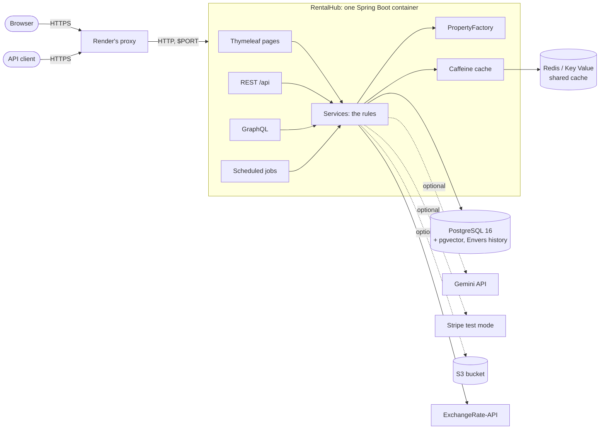

# RentalHub

A property listing, booking and host-management platform in the style of Airbnb: search,
book and pay, reviews and favourites, a host's listings and photos, and questions answered in
plain words — in English, Hindi or Spanish. A portfolio project.

Java 21 · Spring Boot 4.1 · PostgreSQL 16 + pgvector · Flyway · Redis + Caffeine · Thymeleaf ·
Spring AI (Gemini) · Hibernate Envers · Stripe (test mode) · AWS S3 · REST + GraphQL

One deployable Spring Boot container. No separate frontend build, no npm, no second service.
It runs with **no accounts or keys at all**: AI, Stripe and S3 each switch themselves off with a
clear message when their key is missing, and nothing else is affected.

> **Learning the project?** Start with [`docs/learning/`](docs/learning/README.md): one teaching
> doc per phase, covering why each technology was chosen, how each technique works, likely
> interview questions, and what to watch on YouTube. The
> [hands-on guide](docs/learning/hands-on-guide.md) tests every feature step by step.

**Contents:** [What it does](#what-it-does) · [Architecture](#architecture) ·
[Run it locally](#run-it-locally-windows--powershell) · [Deploy to Render](#deploy-to-render) ·
[Environment variables](#environment-variables) · [Design decisions](#design-decisions-and-trade-offs) ·
[The API](#the-api) · [Adding a property type](#adding-a-new-property-type) ·
[For a CV](#project-description-for-a-cv)

---

## What it does

| Page | What it does |
|---|---|
| `/` | Search by city, guests, a price ceiling and a currency; listing cards, 12 a page |
| `/listings/{id}` | Photos, details, reviews; book and pay with Stripe's test cards; save to favourites; for its host, add or remove photos |
| `/bookings` | Your bookings, totals in another currency, cancel with a full refund |
| `/host/listings/new` | Hosts list a place; each property type's own fields appear when it is chosen |
| `/recommendations` | Ask for a stay in plain words; the answer, and the listings it is about |

There is no login: pick a demo user under **Sign in as** in the navbar. The **Language** menu
switches every page between English, हिन्दी and Español.

**It never opens blank.** On first start with an empty database, the app creates a small demo
world: 4 hosts and 4 guests, 16 listings of all four types in 5 currencies, past stays with
reviews, upcoming bookings and favourites (`bootstrap/DemoDataSeeder`, data in
`src/main/resources/demo/demo-data.json`). It never touches a database that already has users;
`DEMO_DATA_ENABLED=false` switches it off.

Behind the pages: a REST API (23 endpoints, documented at `/swagger-ui.html`), GraphQL at
`/graphql` (editor at `/graphiql`), and a Postman collection in [`postman/`](postman/).

---

## Architecture



- **One container, three entry points.** Pages, REST and GraphQL are thin: all of them call the
  same services, so a rule (a booking's dates, a host's permissions) exists once.
- **Two cache tiers.** A listing is read from Caffeine (in the app's memory), then Redis (shared),
  then Postgres; a change evicts it after its transaction commits. Redis is optional: without it,
  reads go to the database and the health check says DEGRADED rather than DOWN.
- **Postgres does the hard guarantees.** An exclusion constraint makes double booking
  impossible even under a race; `pgvector` holds the listings' embeddings for search by meaning;
  Envers keeps every change's history with who made it.
- **Dotted lines are optional.** With no key, the AI answers from an ordinary search, payments go
  to a built-in simulator, and photo uploads are refused politely.

---

## Run it locally (Windows / PowerShell)

**You need:** JDK 21, Docker Desktop (running), and Git. Maven is not needed: the wrapper
(`mvnw.cmd`) downloads the right version itself.

1. **Start Postgres and Redis** (from the repository folder):

   ```powershell
   docker compose up -d
   ```

2. **Check both are healthy.** `STATUS` should say `(healthy)` for both after a few seconds:

   ```powershell
   docker compose ps
   ```

3. **Run the tests.** They start their own throwaway Postgres, Redis and MinIO in Docker, so
   Docker Desktop must be running. Expect `BUILD SUCCESS` after a few minutes:

   ```powershell
   .\mvnw.cmd test
   ```

4. **Start the app.** If port 8080 is taken on your machine (see the table below), set another
   port first, in the same window:

   ```powershell
   $env:PORT = "8081"
   ```

   ```powershell
   .\mvnw.cmd spring-boot:run
   ```

   ✅ Look for `Started RentalHubApplication`, and, on an empty database, a line starting
   `demo.seeded users=8 listings=16`. Flyway creates every table on first start.

5. **Check it's alive.** Expect `{"groups":["liveness","readiness"],"status":"UP"}`:

   ```powershell
   curl.exe http://localhost:8081/actuator/health
   ```

6. **Open it:** http://localhost:8081. You should see 16 places; pick someone under
   **Sign in as**. (If the database already had data, the app left it alone and logged
   `demo.skipped reason=database not empty`; wipe it as below to see the demo world.)

To wipe the local database and start over (the demo data comes back on the next start):

```powershell
docker compose down -v
```

```powershell
docker compose up -d
```

To run the same container image Render runs, see [Deploy to Render](#deploy-to-render), step 0.

### Likely problems on Windows

| Symptom | Cause | Fix |
|---|---|---|
| `Web server failed to start. Port 8080 was already in use` | Another program owns 8080 — often Oracle Database's listener (`TNSLSNR`) | See who: `Get-NetTCPConnection -LocalPort 8080 -State Listen`. Run on another port: `$env:PORT = "8081"`, in the window you start the app from |
| Tests fail with `Could not find a valid Docker environment` | Docker Desktop isn't running | Start it, wait for "Engine running", run the tests again |
| `curl` asks for `Uri:` or prints a PowerShell error | In Windows PowerShell, `curl` is a different command | Type `curl.exe` |
| `Connection refused` to `localhost:5432`, or `Unable to connect to Redis` | The containers aren't up | `docker compose up -d`, then `docker compose ps` |
| A `-Dsomething=value` flag is ignored or errors | PowerShell splits unquoted `-D` arguments at the dot | Quote it: `.\mvnw.cmd test "-Dtest=PropertyFactoryTest"` |
| `Validate failed: Migration checksum mismatch` | Your local database was made by an older draft of a migration | `docker compose down -v`, then `docker compose up -d` |
| Hindi shows as `????` or boxes in PowerShell | The console isn't reading UTF-8, or its font lacks Devanagari | `[Console]::OutputEncoding = [Text.Encoding]::UTF8`, and use Windows Terminal |
| The pages have no styling | Bootstrap comes from a CDN, and the machine is offline | Connect; everything works, just unstyled |
| Signed out after restarting the app | Sessions live in the app's memory | Pick the user again under **Sign in as** |

---

## Deploy to Render

Everything Render needs is in [`render.yaml`](render.yaml), a *Blueprint*: the web service
(built from the [`Dockerfile`](Dockerfile)), a Postgres database and a Key Value store (Render's
Redis). All on **free plans**, in the Singapore region.

**Free-plan limits, before you start:**
- the site **sleeps after 15 minutes** without visitors; the next visit wakes it, which takes
  about a minute plus the app's start-up (about two and a half minutes on the free CPU);
- the free **database expires after 30 days** (then 14 days' grace to upgrade); a new one is
  refilled with the demo data on the next start;
- the free Key Value keeps nothing across restarts, which is fine for a cache.

0. **Optional: try the image on your machine first.** It builds the same image Render does:

   ```powershell
   docker build -t rentalhub .
   ```

   ✅ `naming to docker.io/library/rentalhub` at the end (about 3 minutes the first time, seconds
   after a code-only change). The [hands-on guide](docs/learning/hands-on-guide.md), Parts 73–75,
   runs it with Render's free-plan memory and CPU.

1. **Push the repository to GitHub** (Render deploys from there). `render.yaml` must be on the
   branch you deploy, normally `main`.
2. **Create a Render account** at [render.com](https://render.com), signing up with GitHub. No
   card is needed for free plans.
3. **Dashboard → New → Blueprint.** Connect your GitHub account if asked, and give Render access
   to the `rentalhub` repository. Select it, click **Connect**.
4. **Name the Blueprint** (e.g. `rentalhub`) and choose the branch (`main`). Render reads
   `render.yaml` and lists what it will create: `rentalhub`, `rentalhub-db`, `rentalhub-cache`.
5. **Fill in the secret variables** it asks for: `GEMINI_API_KEY`, `STRIPE_SECRET_KEY`,
   `S3_BUCKET`, `AWS_REGION`, `AWS_ACCESS_KEY_ID`, `AWS_SECRET_ACCESS_KEY`. **Leave empty any you
   don't have**: that feature stays off and says so. (See
   [Environment variables](#environment-variables) for where each one comes from.)
6. **Click Deploy Blueprint.** The database and Key Value come up in a minute or two; the web
   service then builds the Docker image (about 5 minutes the first time), starts it, and waits
   for `/actuator/health` to answer 200. Its status becomes **Live**.
7. **Open the site:** the `https://rentalhub-….onrender.com` address at the top of the
   `rentalhub` service's page. You should see the 16 demo listings. In the service's **Logs**,
   look for `"message":"demo.seeded"` (the logs are JSON on Render).
8. **Check the health:** `https://<your address>/actuator/health` → `"status":"UP"`.

**Adding a key later** (for example, when you get a Gemini key): the `rentalhub` service →
**Environment** → add or edit the variable → **Save, rebuild, and deploy**.

**Updating the site:** push to `main`. Render rebuilds and redeploys by itself
(`autoDeployTrigger: commit`); only the changed image layers are uploaded.

---

## Environment variables

Every setting the app reads from its environment. Locally, none is needed: the defaults point at
`docker-compose.yml`. **Never put a real key in a file in this repository.**

**Who sets what on Render:**
- **Render itself**, on every service: `PORT` (10000), and `RENDER_*` variables the app doesn't use.
- **The Blueprint** (`render.yaml`), automatically: `SPRING_PROFILES_ACTIVE`, the five `DB_*`
  variables (from `rentalhub-db`) and `REDIS_URL` (from `rentalhub-cache`).
- **You, by hand:** the keys. Render asks for them when the Blueprint is created; later, on the
  service's **Environment** page.

| Variable | What it's for | Where to get it | Required? | On Render |
|---|---|---|---|---|
| `PORT` | The port the app listens on | — | No (8080 if unset) | Set by Render (10000) |
| `SPRING_PROFILES_ACTIVE` | `render`: JSON logs, HTTPS-only cookie, pool sizes for a small machine | — | On Render | Set by `render.yaml` |
| `DB_HOST`, `DB_PORT`, `DB_NAME`, `DB_USERNAME`, `DB_PASSWORD` | The Postgres database (given as parts: Render's own connection string starts `postgres://`, which Java's driver refuses) | Render's database | Yes | Filled in by `render.yaml` from `rentalhub-db` |
| `REDIS_URL` | The shared cache, `redis://host:port` | Render's Key Value | No: without it every read goes to the database, and health says DEGRADED | Filled in by `render.yaml` from `rentalhub-cache` |
| `GEMINI_API_KEY` | Search by meaning and written answers | [aistudio.google.com/apikey](https://aistudio.google.com/apikey): free, no card | No: without it, answers come from an ordinary search | You: at Blueprint creation, or **Environment** |
| `STRIPE_SECRET_KEY` | Real Stripe **test-mode** payments (`sk_test_…`; live keys are refused) | [dashboard.stripe.com](https://dashboard.stripe.com) → Developers → API keys, in test mode | No: without it, a built-in simulator takes the payments | You |
| `S3_BUCKET` | Listing photos | AWS console → S3 → Create bucket (leave "Block all public access" on) | No: without it, uploads are refused with a message | You |
| `AWS_REGION` | The bucket's region, e.g. `ap-south-1` (Mumbai) | Shown next to the bucket in the S3 console | With `S3_BUCKET` | You |
| `AWS_ACCESS_KEY_ID`, `AWS_SECRET_ACCESS_KEY` | Credentials allowed to read and write that bucket | AWS console → IAM → Users → (a user with access to the bucket) → Security credentials → Create access key | With `S3_BUCKET` | You |
| `DEMO_DATA_ENABLED` | Create the demo world in an empty database | — | No (on by default) | Optional: `false` to start empty |
| `JAVA_OPTS` | Java's memory settings | — | No (the Dockerfile's suit 512 MB) | Optional |

**Local only, for trying things:** `S3_ENDPOINT` and `S3_PATH_STYLE` (an S3-compatible server
such as MinIO), `STRIPE_API_BASE` (stripe-mock), `FX_RATES_URL` (another exchange-rate source),
and the schedules of the three background jobs (`STALE_LISTINGS_CRON`, `STALE_LISTINGS_ZONE`,
`PAYMENT_RECONCILIATION_CRON`, `PAYMENT_STALE_AFTER`, `EMBEDDING_INDEX_CRON`; `-` switches one off).

---

## Design decisions and trade-offs

The full list, with the reasoning, is the decisions register in the
[project log](docs/learning/project-log.md#4-decisions-register). The main ones:

| Decision | Instead of | Trade-off |
|---|---|---|
| One Spring Boot container (pages, REST, GraphQL, jobs, AI) | Microservices, a separate frontend | Simple to build, deploy and reason about; scales as one unit |
| Server-rendered Thymeleaf pages | A React single-page app | No build step, fast first load, forms work without JavaScript; less interactive |
| Two cache tiers, evicted after commit | Caching in Redis only, or not at all | Fast repeated reads; stale data only for the instant between commit and eviction; one instance's memory cache would need a broadcast to scale out |
| Optimistic locking + a Postgres exclusion constraint, with retry | Locking rows, or checking in Java only | No waiting on locks; the database is the final word on double booking |
| Payment as a saga: hold the dates, create, record, confirm, settle | One database transaction around Stripe | A rollback can't undo a charge; every failure point is recoverable by a reconciliation job |
| `BigDecimal` money, prices in five currencies for display only | `double`; storing converted prices | Exact to the paisa; what is charged is always the listing's own price |
| Rules parse the question; SQL answers statistics; the model only writes from retrieved listings, and is checked | Letting the model decide | Deterministic and testable; the model can't invent a listing |
| Every optional service degrades when its key is missing | Failing at start-up | Deployable before any account exists; each feature says when it's off |
| Free Render plans | Paid plans | ₹0, but the site sleeps when idle and the database expires after 30 days |

---

## The API

> Step-by-step, with the expected output of every command: the
> [hands-on guide](docs/learning/hands-on-guide.md). Ready-made request bodies are in
> [`samples/api/`](samples/api/README.md).

The acting user is the `X-Demo-User-Id` header. With the demo data, user 1 is the host Asha
Menon and user 5 the guest Ravi Kumar.

| Method | Path | Who | What |
|---|---|---|---|
| `GET` | `/api/properties/{id}` | anyone | One listing. Cached: Caffeine → Redis → database |
| `GET` | `/api/properties?city=&guests=&maxPrice=&currency=&page=&size=` | anyone | One page of search results. `maxPrice` is in `currency` (INR if not given) and compared with each listing in its own currency. Cached in Redis |
| `POST` | `/api/properties` | a host | Create a listing |
| `PUT` | `/api/properties/{id}` | that listing's host | Replace a listing (full new state) |
| `DELETE` | `/api/properties/{id}` | that listing's host | Delete a listing (409 if it has bookings) |
| `POST` | `/api/bookings` | any user | Book and pay for a stay (not at your own listing). Safe against double booking. 201 paid, 202 payment outcome not known yet, 402 card declined, 503 payment provider unavailable |
| `GET` | `/api/bookings` | any user | Your own trips, latest first |
| `GET` | `/api/bookings/{id}` | its guest or the listing's host | One booking |
| `POST` | `/api/bookings/{id}/cancel` | its guest or the listing's host | Cancel, until check-in day. Frees the dates, and refunds a paid booking in full |
| `GET` | `/api/properties/{id}/bookings` | that listing's host | Every booking of the listing |
| `GET` | `/api/properties/{id}/history` | that listing's host | Every change to the listing: when, by whom, what changed (still readable after deletion) |
| `POST` | `/api/properties/{id}/reviews` | a guest whose stay there has ended | Review the listing (once) |
| `GET` | `/api/properties/{id}/reviews` | anyone | The listing's reviews, newest first |
| `GET` | `/api/reviews/{id}` | anyone | One review |
| `PUT` | `/api/reviews/{id}` | its author | Replace the rating and comment |
| `DELETE` | `/api/reviews/{id}` | its author | Delete the review (its history is kept) |
| `PUT` | `/api/properties/{id}/favorite` | any user | Save a listing. Sending it twice leaves one favourite |
| `DELETE` | `/api/properties/{id}/favorite` | any user | Unsave it. Removing one that is not saved is not an error |
| `GET` | `/api/favorites?currency=` | any user | Your saved listings, newest first |
| `GET` | `/api/recommendations?q=&currency=` | any user | Ask in plain English. Always 200, with or without AI |
| `POST` | `/api/properties/{id}/images` | that listing's host | Upload a photo (`multipart/form-data`, part `file`): JPEG, PNG or WebP, at most 5 MB, 10 per listing. 503 when no storage is configured |
| `DELETE` | `/api/properties/{id}/images/{imageId}` | that listing's host | Remove a photo (the file is deleted from storage after the commit) |
| `GET` | `/images/listings/{id}/{file}` | anyone | A photo's bytes, served by the app from a private bucket |

A first try, with the app on port 8081 and the demo data loaded:

```powershell
Invoke-RestMethod "http://localhost:8081/api/properties?city=goa&guests=4&currency=USD"
```

```powershell
$stay = @{ propertyId = 1; checkIn = (Get-Date).AddDays(60).ToString("yyyy-MM-dd"); checkOut = (Get-Date).AddDays(63).ToString("yyyy-MM-dd"); guests = 2; paymentMethodId = "pm_card_visa" } | ConvertTo-Json
```

```powershell
Invoke-RestMethod -Method Post -Uri http://localhost:8081/api/bookings -Headers @{ "X-Demo-User-Id" = "5" } -ContentType "application/json" -Body $stay
```

The booking comes back `CONFIRMED`, paid (`payment.status` `PAID`, provider `SIMULATED`):
3 nights of the Quiet garden villa, `totalAmount` 27000.00 INR. Send it again: 409, those dates
are taken.

**More to know:**
- **Languages:** every message in English, Hindi or Spanish — `?lang=hi` on any request
  (remembered in a cookie), else `Accept-Language`, else English.
- **Payments:** without `STRIPE_SECRET_KEY` a simulator answers to Stripe's test
  payment-method ids (`pm_card_visa` succeeds, `pm_card_visa_chargeDeclined` is declined);
  with a test key the same requests go to Stripe; a live key is refused.
- **Currencies:** add `?currency=USD` (or INR, EUR, GBP, AED) to any read; rates from
  [ExchangeRate-API](https://www.exchangerate-api.com), kept for an hour, display only.
- **Photos without AWS:** `docker compose --profile photos up -d` starts MinIO, an
  S3-compatible server (the hands-on guide, Part 56, has the three extra steps).
- **Tracing:** every response has an `X-Request-Id`; the same id is on every log line written
  while handling it.

---

## Adding a new property type

1. Add a value to `PropertyType`.
2. Add an entity class extending `Property` with `@DiscriminatorValue` and `typeAttributes()`.
3. Add a `@Component` creator extending `AbstractPropertyCreator`, declaring its
   `AttributeSpec`s and rules.
4. Add a Flyway migration for the new columns.
5. Add translated labels (`property.type.X`, `property.attribute.*`) to the messages files.

No controller, service, form, view or existing creator changes: the "list a place" form and
the listing page build the type's fields from its `AttributeSpec`s. `PropertyFactoryTest`
fails if the entity, creator and labels disagree, or if a page template names a type; the app
refuses to start if a type has no creator.

---

## Project description for a CV

**RentalHub — property booking platform (Java 21, Spring Boot 4, PostgreSQL, Redis, Spring AI).**
A production-style Airbnb clone built as a single deployable Spring Boot container: server-rendered
pages, a 23-endpoint REST API and GraphQL over one service layer, in three languages, running on
Render from a Docker image and a one-file Blueprint, and fully usable with no third-party
accounts — every optional service degrades cleanly without its key. Covered by 401 automated
tests against real Postgres, Redis and S3-compatible storage in Docker.

- **Made double booking impossible under concurrency** with optimistic locking, a PostgreSQL
  exclusion constraint and retry with backoff, proven by a test that fires simultaneous bookings;
  modelled payment as a saga with idempotency keys and a reconciliation job, so a lost Stripe
  response or a crash between steps never charges twice or loses a booking.
- **Built grounded AI search in Java with Spring AI and pgvector:** rule-based query parsing,
  hybrid retrieval (SQL filters plus vector similarity), statistics answered by SQL, and a
  post-check that removes any listing the model invents; the feature degrades to plain search
  with no API key.
- **Cut repeat reads to memory speed with a two-tier cache** (Caffeine + Redis) evicted after
  commit, survived a Redis outage with a DEGRADED-not-DOWN health check, and kept a full audit
  trail of who changed what with Hibernate Envers.
