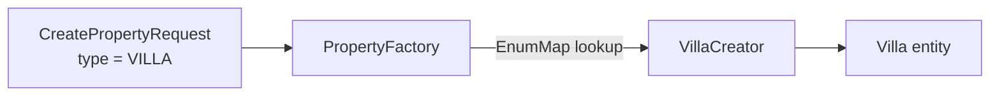

# 01 — Foundation

**What Phase 1 built:** the project skeleton (build, configuration, local database), the
database schema, the Java classes that mirror it, and the one component that creates
listings, the **factory**. Also the error-message plumbing that later lets the app speak
three languages, and tests that prove all of it against a real PostgreSQL.

Nothing is visible in a browser yet. That's normal: the foundation is what every later
phase stands on, and it holds several of the project's best interview stories.

---

## 1. The build: Maven, the Boot parent, starters, the wrapper

📄 `pom.xml`, `.mvn/wrapper/maven-wrapper.properties`, `mvnw.cmd`

- **`pom.xml`** lists what the project depends on. Maven downloads those libraries (and
  *their* dependencies) from Maven Central into `%USERPROFILE%\.m2`.
- **The Spring Boot parent** (`spring-boot-starter-parent` 4.1.1) is a curated list of
  versions that are known to work together. That's why most dependencies have no
  `<version>`: the parent picks it. This avoids "dependency hell", where library A needs
  Jackson 2.15 and library B needs 2.17.
- **Starters** are bundles. `spring-boot-starter-data-jpa` pulls in Hibernate, Spring
  Data, a connection pool (HikariCP) and transaction support in one line.
- **Scopes:** `runtime` (the Postgres driver: needed to run, never referenced in code),
  `test` (only on the test classpath), `optional` (Lombok and devtools: never shipped).
- **The wrapper** (`mvnw.cmd`) downloads the exact Maven version pinned in
  `maven-wrapper.properties`, so every machine and CI server builds the same way.

**Two small build fixes worth knowing:**
- *Lombok is declared as an annotation processor explicitly.* Lombok works by generating
  code during compilation. Newer JDKs no longer run annotation processors just because
  they're on the classpath, so the build says so explicitly.
- *Mockito is loaded as a `-javaagent`.* Mockito (used by Spring's test support) modifies
  classes at runtime through a Java agent. JDK 21 warns when agents attach themselves
  dynamically and future JDKs will block it, so surefire loads it properly at startup.

---

## 2. Spring Boot essentials used so far

📄 `RentalHubApplication.java`, `application.yml`, `application-local.yml`

**Beans and dependency injection.** `@SpringBootApplication` tells Spring to scan the
`com.rentalhub` package for classes marked `@Component` (and friends), create one
instance of each (a *bean*), and wire them together. `PropertyFactory` shows this:

```java
public PropertyFactory(List<PropertyCreator> availableCreators) { ... }
```

We never write `new ApartmentCreator()`. Spring sees the constructor wants "every bean
that implements `PropertyCreator`" and passes all four. Add a fifth creator class and it
is injected too, with no other change. That's the foundation of the Factory design (§8).

**Constructor injection** (dependencies as constructor parameters, not `@Autowired`
fields) makes dependencies explicit, lets fields be `final`, and makes classes trivial
to build by hand in tests: `new GlobalExceptionHandler(testMessages)`.

**Externalised configuration.** `application.yml` never contains real secrets:

```yaml
url: jdbc:postgresql://${DB_HOST:localhost}:${DB_PORT:5432}/${DB_NAME:rentalhub}
```

`${DB_HOST:localhost}` means "use the environment variable `DB_HOST`, or `localhost` if
it isn't set". Locally the defaults match `docker-compose.yml`; on Render, environment
variables override them. The URL is built from parts because Render's ready-made
connection string starts with `postgres://`, which the Java driver doesn't accept.

**Profiles.** `spring.profiles.default: local` means that with no profile chosen,
`application-local.yml` is layered on top (debug logging, template caching off). Render
will set `SPRING_PROFILES_ACTIVE=render` for production settings.

**`open-in-view: false`.** By default Spring keeps the database session open until the
web page has finished rendering ("Open Session in View"). That lets a template touch
`property.host.fullName` and silently fire an extra query per row, the **N+1 problem**,
while holding a database connection during rendering. Turning it off forces services to
load exactly what a page needs, and makes mistakes fail loudly
(`LazyInitializationException`) instead of quietly slowing everything down.

---

## 3. JPA and Hibernate

📄 `domain/model/*.java`, `domain/repository/*.java`

**JPA** is the standard Java API for ORM; **Hibernate** is the implementation. An
`@Entity` class maps to a table, and each field maps to a column.

- **`@Id @GeneratedValue(strategy = IDENTITY)`**: Postgres generates the id
  (`GENERATED BY DEFAULT AS IDENTITY`) when the row is inserted.
- **`@ManyToOne(fetch = LAZY)`**: loading a Booking doesn't load its Property until you
  touch it. Eager loading everywhere is a classic performance trap.
- **`@Version`**: a counter Hibernate increments on every update and checks with
  `UPDATE ... WHERE id = ? AND version = ?`. If another transaction changed the row
  first, zero rows match and Hibernate throws. That's **optimistic locking**, and phase 3
  builds the booking race protection on it.
- **Repositories** like `PropertyRepository extends JpaRepository<Property, Long>` get
  `save`, `findById` and friends for free. `findByActiveTrueAndAvailableUntilBefore(date)`
  is turned into SQL from the method name. `search(...)` is built from **Specifications**
  (small reusable query pieces), adding a filter only when it's given (see §13 for the
  bug that led to this).

### Inheritance: why SINGLE_TABLE

Apartment, Villa, Cabin and Studio share most fields. JPA offers three ways to store a
class hierarchy:

| Strategy | Tables | Search across all types | Cost |
|---|---|---|---|
| **SINGLE_TABLE** (ours) | one `properties` table + `property_type` column | one table, no joins: fastest | subtype columns must be nullable |
| JOINED | parent table + one table per subtype | join to every subtype table | slower queries, more complex SQL |
| TABLE_PER_CLASS | one full table per subtype | `UNION` of all tables | worst for polymorphic queries |

Search is the hottest query in a listings site and always spans every type, so
SINGLE_TABLE wins. The cost (nullable columns) is covered by the creators' validation.

**`getType()` is an abstract method, not a mapped field.** Each subclass returns its own
constant. If `type` were also a field, Java and the database could disagree (a Villa
object with `type = CABIN`). This way the class *is* the type.

### Why no setters on `id`, `version` and timestamps

`@Setter(AccessLevel.NONE)` removes them. Those values belong to the database and
Hibernate. Code that sets `version` by hand would defeat optimistic locking.

### Why never Lombok `@Data` on entities

`@Data` generates `equals`, `hashCode` and `toString` from **all** fields. On an entity:
1. `id` is null before saving and set after, so `hashCode` changes: an entity stored in
   a `HashSet` gets "lost" inside it.
2. Touching lazy collections in `equals`/`toString` fires surprise queries, or throws
   `LazyInitializationException` outside a transaction.
3. Two entities that reference each other (Property ↔ PropertyImage) make `toString` call
   itself forever: `StackOverflowError`.

So entities use only `@Getter`/`@Setter`.

---

## 4. Flyway and the schema

📄 `db/migration/V1__initial_schema.sql`

**How Flyway works.** On startup, Flyway looks at `db/migration`, compares the files with
its `flyway_schema_history` table, and runs any new ones in version order. It stores a
**checksum** of each file it ran. If a file changes after it ran, the checksums differ
and Flyway refuses to start. That's why the rule is **never edit a committed migration;
add V2**. V1 was edited in this phase only because it had never left your machine.

**Why `ddl-auto: validate`.** Hibernate compares every entity with the real tables at
startup and refuses to start if they disagree (a missing column, a wrong type). It never
changes the schema itself: Flyway is the only thing allowed to.

**Why `baseline-on-migrate` was removed.** It tells Flyway: "if the database already has
tables but no history, assume it's already at version 1." On a real database that would
mean V1 **never runs**. It's a tool for adopting Flyway on a legacy database, not for a
new project.

### Column types and constraints

- **`NUMERIC(19,4)` for money**: exact decimal, 15 digits before the point and 4 after.
  Never `REAL`/`DOUBLE PRECISION` (see §7).
- **`CHECK` constraints** guard universal truths: `price_per_night > 0`,
  `rating BETWEEN 1 AND 5`, `check_out > check_in`, `bedrooms >= 0`.
- **`status` is checked against a fixed list.** The overlap constraint (§5) matches the
  exact strings `'PENDING'` and `'CONFIRMED'`. A typo like `'CONFIRMD'` would silently
  escape it, so the database refuses unknown statuses.
- **Per-type rules (villa plot ≥ 100 m²) are *not* in the database.** They're business
  rules that change and need friendly, translated messages, so they belong in the creators.

### Indexes

An index is a sorted lookup structure (a **B-tree** by default) that lets Postgres jump
to matching rows instead of scanning the whole table, turning an O(n) scan into roughly
O(log n).

- **`lower(city)`** is an *expression index*. Search compares `LOWER(p.city) = LOWER(:city)`;
  a plain index on `city` couldn't be used for that expression, but an index on
  `lower(city)` can.
- **Every foreign key gets an index.** Postgres automatically indexes primary keys and
  unique constraints, **but not foreign keys**. Without an index on `reviews.author_id`,
  "all reviews by this user" scans every review, and deleting a user makes Postgres scan
  the child tables to check references. Two were missing in the first draft
  (`reviews.author_id`, `favorites.property_id`) and were added.
- `favorites` has no separate index on `user_id` because the unique constraint
  `(user_id, property_id)` already created one that *starts* with `user_id`, and a
  B-tree can serve lookups on its leading column.

---

## 5. The double-booking constraint (the algorithm)

```sql
ALTER TABLE bookings ADD CONSTRAINT no_overlapping_bookings
    EXCLUDE USING gist (
        property_id WITH =,
        daterange(check_in, check_out, '[)') WITH &&
    ) WHERE (status IN ('PENDING', 'CONFIRMED'));
```

In words: **"no two rows may have equal `property_id` AND overlapping date ranges, among
live bookings."**

**Half-open ranges `[)`.** A stay is `[check_in, check_out)`: the check-in night counts,
the check-out day doesn't. So a guest leaving on the 15th and the next arriving on the
15th don't collide:

```
Dec:        10  11  12  13  14  15  16  17
Guest A:    [===================)             10 → 15
Guest B:                        [=========)   15 → 18   ✅ touches, doesn't overlap
Guest C:                    [=======)         14 → 16   ❌ overlaps A on the 14th
```

**The overlap rule.** Two half-open ranges `[a, b)` and `[c, d)` overlap exactly when
`a < d AND c < b`: each starts before the other ends. That's what `&&` computes, and it's
the same logic as `BookingRepository.countOverlapping`.

**GiST and `btree_gist`.** A normal B-tree index answers "equal / less than", not "do
these ranges overlap". **GiST** (Generalized Search Tree) is an index type that can
answer overlap questions. The constraint needs one index that handles *both* `=` on a
number and `&&` on a range; the `btree_gist` extension teaches GiST how to do `=` on
ordinary types. On every insert, Postgres searches that index for a conflicting row.

**Partial constraint.** The `WHERE` clause means cancelled and completed bookings don't
block dates. Cancelling frees the calendar with no extra code.

**It's race-proof.** If two transactions insert conflicting bookings at the same moment,
the second one waits for the first to commit, then fails. The database guarantees
that no interleaving of requests can produce a double booking.

`BookingOverlapConstraintTest` proves each of these behaviours with plain SQL inserts.

---

## 6. Why both optimistic locking (phase 3) and the constraint — not redundant

They protect different things at different layers:

1. **The constraint is the last line of defence, and covers every writer.** Anything that
   writes to `bookings` — the service, the demo seeder, an admin in `psql`, a future
   second service, or a bug that forgets the lock — is held to it. Application-level
   locking only protects the code paths that remember to use it.
2. **Optimistic locking protects more than overlaps.** Phase 3 bumps the *property's*
   version on every booking. That also catches "the host changed the price or capacity
   while this booking was being made", so the total is never computed from stale data.
   The constraint knows nothing about prices.
3. **They fail differently.** A version conflict is expected and retryable: the service
   retries, re-reads and returns a friendly "those dates were just taken". A constraint
   violation is a raw database error, useful as a guarantee but not a user experience.
   Phase 3 maps both to the same message.

**Interview line:** *"The application layer gives the good user experience and business
consistency; the database constraint is the correctness guarantee that holds even when
the application is wrong. That's defence in depth."*

---

## 7. Money: why BigDecimal

📄 `Property.pricePerNight`, `Currency.fractionDigits()`, `AbstractPropertyCreator.validateCommon`

`double` stores numbers in binary. Most decimal fractions (0.1, 0.2) have no exact binary
form, just as 1/3 has no exact decimal form:

```java
0.1 + 0.2              // 0.30000000000000004
new BigDecimal("0.1").add(new BigDecimal("0.2"))   // 0.3 exactly
```

Across thousands of bookings these errors add up, and the books stop balancing.
`BigDecimal` stores an exact decimal. Phase 5 adds `MoneyMathTest` to demonstrate the
drift.

**`compareTo`, never `equals`.** `BigDecimal` has a *value* and a *scale* (digits after
the point). `new BigDecimal("2.5").equals(new BigDecimal("2.50"))` is **false** because
the scales differ; `compareTo` returns 0 because the values are equal. The database
returns `14.50` for a stored `14.5`, so `equals` would report a change that isn't one.
`PersistenceMappingTest` compares with `compareTo` for exactly this reason.

**Prices must fit their currency.** Rupees, dollars and euros use 2 decimal places, so
₹2500.125 isn't a real price. `validateCommon` rejects prices with more decimals than
`Currency.fractionDigits()`, which reads the ISO 4217 standard from the JDK rather than
hard-coding "2" (the yen has 0). `stripTrailingZeros()` means `2500.0000` counts as a
whole number, not as four decimals.

---

## 8. The Factory, the Template Method, and data-driven attributes

📄 `factory/*.java`, `factory/impl/*.java`, `dto/CreatePropertyRequest.java`

### The problem

Four property types with genuinely different rules, and a hard rule: **no `if`/`switch` on
property type anywhere.** Every `switch (type)` is a place you must remember to update
when a type is added. Miss one and you have a bug.

### Factory with a registry



`PropertyFactory` puts every injected creator into an `EnumMap<PropertyType, PropertyCreator>`,
keyed by `supportedType()`. Creating a listing is a single map lookup, `creators.get(type)`,
with no branching. An `EnumMap` is backed by a plain array indexed by the enum's position,
so the lookup is O(1) and allocation-free.

**Fail fast.** The constructor refuses to start if any `PropertyType` has no creator, or
two. A forgotten creator crashes the app at boot, in development, not when the first host
picks that type in production.

### Template Method inside the factory

Every type follows the same recipe. `AbstractPropertyCreator.create()` fixes the order and
is `final`, so no subtype can skip or reorder a step:

```
create(request, host)                      ← final: the template
 ├─ validateCommon(request)                ← shared: price, currency, guests…
 ├─ TypeAttributes.parse(attributes, specs)← shared: required? readable? allowed?
 ├─ validateSpecific(request, attributes)  ← ABSTRACT: each type's own rules
 ├─ build(attributes)                      ← ABSTRACT: new Villa(), set its fields
 ├─ applyCommonFields(...)                 ← shared: title, city, price…
 └─ enforceInvariants(property)            ← hook: e.g. studio bedrooms = 0
```

The rules really differ per type: an apartment above floor 4 must state whether there's a
lift; a villa needs a plot of 100 m² or more, sleeps at least 4 and has 2+ bedrooms; a
cabin must declare its heating (safety information for remote places) and be 0–200 km from
town; a studio sleeps at most 3, is at least 12 m², and always has zero bedrooms.

**A bug the first draft had:** `StudioCreator.build()` forced bedrooms to 0 by *changing
the caller's request object*. It only worked because `applyCommonFields` happened to run
afterwards, and it would also have shown "0" in the form if validation failed. The fix is
the `enforceInvariants` hook, which runs last and touches only the new entity. A test
checks that the request is left alone.

### Data-driven type-specific fields

The first draft's request class had a field for every subtype (`floorNumber`, `plotAreaSqm`…).
Adding a type meant editing it, and the form, and the API. The design now:

- Each creator declares its fields as **`AttributeSpec`s**: name, kind (INTEGER, DECIMAL,
  BOOLEAN, CHOICE), required or not, allowed choices.
- The request carries them in a generic **`Map<String, String> attributes`**.
- **`TypeAttributes.parse`** checks the map against the specs, identically for every type:
  1. reject any non-blank key the type doesn't declare (a plot area sent with an apartment
     is a client bug, not data to silently drop);
  2. for each spec: blank → missing (an error if required); otherwise parse it with the
     kind, and check it against the choice list.
- Each entity exposes **`typeAttributes()`** (name → value), so later pages and the
  GraphQL API can show any type's fields by looping, never branching.
- **`AttributeKind` is a "polymorphic enum":** each constant carries its own `parse`
  method. That's how a `switch (kind)` is avoided too: behaviour lives *with* the constant.

**Result:** adding a type is an enum value, an entity, a creator, a migration and
translated labels. `PropertyFactoryTest` checks each entity's attributes match its
creator's specs and that every label exists, so a mismatch fails the build.

**The trade-off (say this in interviews):** type-specific values arrive as text, so the
compiler can no longer check them; each creator reads them through typed accessors
(`attributes.decimal("plotAreaSqm")`). Asking for an undeclared attribute throws
immediately, so mistakes surface in tests. I accepted that for the ability to add types
without touching forms or APIs, which is the **Open/Closed Principle**: open for
extension, closed for modification.

---

## 9. Error messages that can be translated

📄 `exception/*.java`, `messages.properties`

Code throws **message keys**, never English:

```java
throw PropertyValidationException.onField("maxGuests", "property.villa.guests.min", 4);
```

- `messages.properties` maps the key to text: `A villa must sleep at least {0} guests.`
  Phase 7 adds `messages_hi` and `messages_es` with the same keys, and nothing in the Java
  code changes.
- `LocalizedException` implements Spring's `MessageSourceResolvable`, so any `MessageSource`
  can render it: `messages.getMessage(exception, locale)`.
- **Arguments can be translated too.** "{0} is required" gets a *label key* as its argument
  (`property.attribute.plotAreaSqm`), which Spring resolves in the same language, giving
  "Plot area (m²) is required for this type of property."
- **`field`** records which form input was wrong (`attributes[plotAreaSqm]`), so phase 8
  can show the error next to it.
- **`GlobalExceptionHandler`** turns these into standard **RFC 9457 Problem Details** JSON
  for REST clients:

  ```json
  {
    "type": "about:blank",
    "title": "The request was not valid",
    "status": 400,
    "detail": "Plot area (m²) is required for this type of property.",
    "field": "attributes[plotAreaSqm]",
    "messageKey": "property.attribute.required"
  }
  ```

  It's scoped to `@RestController`s only, so HTML page controllers can show errors on the
  form instead of returning JSON.
- **Language choice** comes from the browser's `Accept-Language` header, which Spring
  passes as the `Locale` parameter. An unknown language falls back to English
  (`fallback-to-system-locale: false` stops it from using the *server's* OS language).
- **Gotcha:** messages with `{0}` arguments go through Java's `MessageFormat`, where `'`
  is an escape character. "doesn't" must be written `doesn''t`. We avoid apostrophes.

---

## 10. The Turkish I (a real bug, fixed)

`"electric".toUpperCase()` uses the computer's default language. In Turkish, the capital
of `i` is `İ` (with a dot), so on a Turkish machine the result is `ELECTRİC`, which never
matches the code `ELECTRIC`, and a valid cabin gets rejected. For identifiers (codes, keys,
enum names), always use `toUpperCase(Locale.ROOT)`. A test sets the default locale to
Turkish to prove the fix, which matters because this app is about to become multilingual.

---

## 11. Testing strategy

📄 `src/test/java/...`

| Test class | Kind | Proves |
|---|---|---|
| `PropertyFactoryTest` | unit (tiny Spring context, no DB) | every rule of every type; key + field of every error; each key exists in `messages.properties`; entity attributes match creator specs; startup fails on missing/duplicate creators |
| `TypeAttributesTest` | unit | parsing: whitespace, strict booleans, null map, creator programming errors, spec consistency |
| `GlobalExceptionHandlerTest` | unit | a key becomes a translated Problem Detail, including a translated argument; unknown languages fall back to English |
| `PersistenceMappingTest` | integration (real Postgres) | Flyway ran V1; Hibernate validated every entity; each type round-trips as its own class; search filters work and are optional (this test caught the bug in §13); bean-validation messages come from our messages file |
| `BookingOverlapConstraintTest` | integration (real Postgres) | overlap refused; back-to-back allowed; cancelled frees dates; other property unaffected; zero-night stays and misspelt statuses refused |

- **Why a real Postgres and not H2?** H2 is an in-memory database often used in tests,
  but it doesn't understand `EXCLUDE USING gist`, `daterange` or pgvector. A test that
  passes on H2 proves nothing about production. **Testcontainers** starts the same
  `pgvector/pgvector:pg16` image `docker-compose.yml` uses, then throws it away.
- **Why `@Transactional` on DB tests?** Each test's changes are rolled back, so tests can't
  affect each other and can run in any order.
- **Context caching:** both integration classes use the same configuration, so Spring
  starts the application (and the container) once and reuses it.
- **Why the factory test scans the package instead of listing creators by hand:** a fifth
  creator is picked up automatically, just like in the real app.

---

## 12. Small things that show care

- **`.gitattributes`** forces `mvnw` to keep Unix line endings. Windows Git would
  otherwise convert it to CRLF, and the Linux Docker build in phase 9 would fail with
  `/bin/sh^M: bad interpreter`.
- **`.gitignore`** excludes `.env` files, so real keys can't be committed by accident.
- **Bean validation on the request *and* checks in the factory.** Controllers validate
  the request's shape; the factory re-checks business rules because it's the one path
  every listing takes (forms, REST, GraphQL, the seeder).

---

## 13. A bug only the real-database test could catch

📄 `domain/repository/PropertySpecifications.java`

The first draft's search query was the textbook "optional filter" JPQL:

```sql
WHERE p.active = true
  AND (:city IS NULL OR LOWER(p.city) = LOWER(:city))
  AND (:maxPrice IS NULL OR p.pricePerNight <= :maxPrice)
```

All 42 unit tests passed. The first time `PersistenceMappingTest` ran it against real
Postgres, searching with no city failed:

```
ERROR: function lower(bytea) does not exist
```

**Why:** when `:city` is null, the driver sends a null with no type attached. Postgres has
to infer the parameter's type from how it's used, the guess comes out as `bytea` (raw
bytes), and there's no `lower()` for bytes. H2 would have happily run this query, which is
exactly why these tests use real Postgres.

**The fix:** `PropertySpecifications` builds the `WHERE` clause from only the filters that
are present. A city-only search becomes `WHERE active AND lower(city) = lower(?)`. Two
wins: no untyped nulls, and a clean clause lets the planner use the `lower(city)` and
price indexes. The `(:x IS NULL OR ...)` shape tends to push Postgres towards scanning.

**Interview line:** *"My integration tests run on real Postgres via Testcontainers, and
that caught a bug in-memory tests would have missed: a null query parameter Postgres typed
as bytea. I replaced the catch-all JPQL with Specifications that only add the filters
present, which also made the query index-friendly."*

---

## Interview questions — practise answering these aloud

**Q: Walk me through what happens when a host creates a villa.**
The request reaches `PropertyFactory.create`, which looks up the villa creator in an
EnumMap — no switch. The creator's final `create` method runs a fixed sequence: shared
checks (price, currency, guests), generic parsing of the type-specific attributes against
the villa's declared specs, the villa's own rules (plot ≥ 100 m², ≥ 4 guests, ≥ 2
bedrooms), then builds the `Villa` and copies the shared fields. Any failure throws an
exception carrying a message key and the field name, which becomes a translated error.

**Q: How would you add a fifth property type?**
An enum value, an entity class, a creator, a Flyway migration, and translated labels. No
service, controller, form or other creator changes. The app refuses to start if I forget
the creator, and a test fails if the entity and creator disagree.

**Q: Why single-table inheritance?**
Search always spans every type and is the hottest query. One table means no joins. The
cost is nullable subtype columns; validation lives in the creators.

**Q: How do you prevent double bookings?**
Two layers. The database has an exclusion constraint: no two live bookings for the same
property may have overlapping date ranges, enforced with a GiST index and race-proof. In
phase 3 the application adds optimistic locking with retry for a clean user experience
and to catch concurrent listing edits. Defence in depth.

**Q: What does `[)` mean in the daterange?**
Half-open: check-in inclusive, check-out exclusive, so same-day turnover doesn't count as
an overlap.

**Q: Why BigDecimal? Why compareTo?**
Binary floating point can't represent most decimal fractions, so money drifts. BigDecimal
is exact. `equals` also compares scale, so 2.5 and 2.50 aren't "equal"; `compareTo`
compares values.

**Q: Why Flyway instead of `ddl-auto=update`?**
Reviewable, versioned SQL that runs identically everywhere. `update` can't rename or drop
and you can't see what it will do to production. Hibernate only validates.

**Q: Why not Lombok @Data on entities?**
Generated equals/hashCode change when the id is assigned, which breaks hash sets; they
and toString can trigger lazy loading or infinite recursion across bidirectional
relationships.

**Q: What's open-session-in-view and why is it off?**
It keeps the DB session open during page rendering, so templates can lazy-load and cause
N+1 queries while holding a connection. Off means services load what's needed and mistakes
fail loudly.

**Q: Why do exceptions carry keys instead of messages?**
So one exception can be rendered in any language, arguments included. The handler resolves
it with the request's locale. Adding a language needs no Java changes.

**Q: Why Testcontainers rather than H2?**
H2 doesn't support exclusion constraints, range types or pgvector. Tests should run on the
same database as production.

**Q: Why do foreign keys need indexes?**
Postgres doesn't create them automatically. Without one, joins and "all rows for this
parent" scan the whole child table, and deleting a parent scans children to check
references.

**Q: What is the Template Method pattern, and where is it?**
A base class defines an algorithm's fixed skeleton in a final method and lets subclasses
fill in specific steps. `AbstractPropertyCreator.create()` is the skeleton;
`validateSpecific` and `build` are the steps.

**Q: What trade-off did the data-driven attributes make?**
Lost compile-time typing of type-specific fields in exchange for adding types without
touching forms and APIs. Mitigated with typed accessors that fail loudly and a test that
checks entities and creators agree.

**Q: Tell me about a subtle bug you fixed.**
The search query's `(:city IS NULL OR ...)` pattern failed on real Postgres with
`lower(bytea) does not exist`, because a null parameter has no inferable type. My
Testcontainers test caught it; I rebuilt search with Specifications that only add the
filters present, which is also index-friendly. Others: the Turkish-I (locale-sensitive
`toUpperCase`), and `baseline-on-migrate`, which would have skipped V1 entirely on a
non-empty database.

**Q: How do you build a search with optional filters?**
With JPA Specifications (or the Criteria API): one small predicate per filter, added only
if that filter was given, combined with AND. No string concatenation, so no SQL
injection, and the resulting SQL contains only the conditions that matter.

---

## Honest limitations (better to say them before an interviewer finds them)

- No authentication (by design: a demo "sign in as" switcher). No Spring Security also
  means no CSRF protection; fine for a demo, not for production.
- Type-specific values are parsed from text; the compiler can't check them.
- Business rules are in Java, not the database, so a direct SQL insert could create a
  2-guest villa. The database guards only universal invariants (positive price, valid
  dates, no overlaps).

---

## Try it yourself

1. **Watch the constraint fire.** Start the containers, run the app once so Flyway creates
   the tables, then in `docker exec -it rentalhub-postgres psql -U rentalhub -d rentalhub`
   insert a user, a property and two overlapping bookings by hand. Read the error.
2. **Break validation.** Rename a column in a *new* `V2__oops.sql` migration and run the
   tests. `PersistenceMappingTest` fails because Hibernate's `validate` catches the drift.
   Delete the file afterwards.
3. **Add a Houseboat** (on a scratch branch): follow the README's five steps and watch
   which tests guide you.
4. **See the Turkish-I:** in `jshell`, run
   `java.util.Locale.setDefault(java.util.Locale.forLanguageTag("tr")); "electric".toUpperCase()`.

---

## YouTube for this phase (in order)

1. `Spring Boot tutorial for beginners` (Amigoscode, Telusko, Dan Vega)
2. `Spring dependency injection constructor injection explained` (Java Brains)
3. `JPA Hibernate tutorial entity relationships lazy loading`
4. `Hibernate inheritance mapping single table joined`
5. `N+1 query problem Hibernate` and `open session in view anti-pattern`
6. `Flyway migrations Spring Boot`
7. `How database indexes work B-tree` (Hussein Nasser)
8. `PostgreSQL exclusion constraint range types` and `GiST index explained`
9. `BigDecimal vs double money Java`
10. `Factory pattern Java` and `Template method design pattern`
11. `Open closed principle SOLID`
12. `Testcontainers Spring Boot` (Dan Vega, SpringDeveloper)
