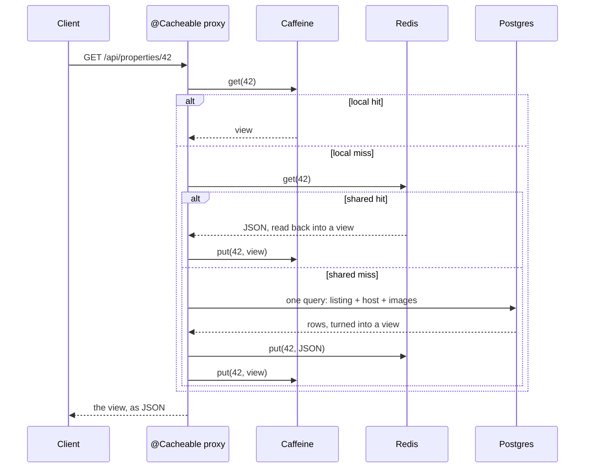
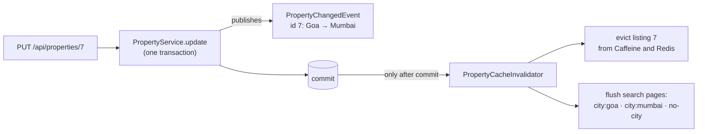

# 02 — Caching

**What Phase 2 built:** a two-tier cache in front of the database (Caffeine inside the app,
Redis shared), the machinery that keeps it correct when listings change, and the first
REST API so you can watch it work. Along the way, updates got the same validation as
creation, and every API error now has the same standard shape.

---

## 1. What a cache is, and why here

A **cache** is a copy of an answer kept somewhere faster than where it came from. Reading
a listing from Postgres means a network round trip, parsing SQL, an index lookup, a join
for the host and images, and turning rows into objects: milliseconds. Reading it from
memory inside the JVM: well under a microsecond.

Caching pays off when data is **read far more often than it is written**. A listing is
viewed thousands of times for every edit. The price is **staleness risk**: the copy can
be out of date. Most of this phase is about controlling that risk.

**Vocabulary**
- **Hit / miss:** the cache had the answer / didn't. **Hit ratio:** the fraction of hits.
- **TTL (time to live):** how long an entry may stay before it expires on its own.
- **Eviction:** removing an entry, to make room or because it expired.
- **Invalidation:** removing an entry *because the data behind it changed*.

**The pattern we use: cache-aside** (also called lazy loading):
1. Look in the cache.
2. Hit → return it.
3. Miss → read the database, store the answer in the cache, return it.
4. On a write → update the database, then invalidate the cached copy; the next read
   reloads it.

Spring's `@Cacheable` does steps 1–3 around a method for you. Step 4 is ours (§6).

---

## 2. Two tiers: Caffeine and Redis

📄 `config/CacheConfig.java`, `cache/TwoLevelCache.java`

| | Caffeine ("L1") | Redis ("L2") |
|---|---|---|
| Where it lives | inside the Java process | a separate server |
| Read cost | sub-microsecond, no network | ~0.5–1 ms: network + JSON |
| Shared by all app instances | no, each has its own | yes |
| Survives an app restart | no | yes |
| Stores | Java objects as they are | bytes (we use JSON) |
| Can fail | not really | yes, so the app must cope (§8) |

"L1/L2" is borrowed from CPU caches: a small, fast cache in front of a bigger, slower one.

- **A single listing (`propertyById`) uses both tiers.** Detail pages for popular listings
  are read constantly, so the local tier absorbs most reads for free, and Redis spares
  the database when a local copy has expired or the app has restarted.
- **Search pages (`propertySearch`) use Redis only.** There are many more distinct search
  pages than listings, and each is only moderately hot. Keeping one shared copy beats
  every instance keeping its own. And search-page invalidation (§6) needs to delete by
  pattern, which Redis can do.

### How Caffeine decides what to throw away (W-TinyLFU)

When the local cache is full (10,000 listings), something has to go.
- **LRU** ("least recently used") is simple, but one burst of one-off reads, like a bot
  crawling every listing, pushes genuinely popular listings out.
- **LFU** ("least frequently used") remembers popularity, but is slow to forget old
  favourites.

Caffeine uses **Window TinyLFU**, which combines the two:
- New entries land in a small "window" area, which is plain LRU.
- When an entry has to leave, Caffeine compares how popular the newcomer is with the
  entry it would replace, and keeps the more popular of the two.
- Popularity comes from a *frequency sketch*, a small table of counters indexed by hashes
  of the key (a Count-Min Sketch). The counters are halved periodically, so old popularity
  fades.

The result is near-optimal hit ratios using very little memory. On top of that,
`expireAfterWrite(30s)` retires every entry 30 seconds after it was written.

### Redis in one paragraph

Redis is an in-memory key–value store. You `SET key value EX 600` (store it for 600
seconds), `GET key`, `DEL key`. It executes commands one at a time on a single thread.
That makes every command atomic and fast, but it also means one slow command blocks
every client (see `KEYS` in §6.5). Keys with a TTL delete themselves.

Our keys look like this:

```
rentalhub:v2:propertyById::42
rentalhub:v2:propertySearch::city:goa|guests:4|maxPrice:5000|currency:INR|page:0|size:20
```

(Phase 2 built them as `v1`, without the currency; Phase 5 added both. See §4 and §5.)

---

## 3. A read, step by step

📄 `service/PropertyService.getListing`



**`sync = true` prevents a cache stampede.** Suppose a popular listing's entry expires and
500 requests for it arrive in the same second. All of them miss, and all 500 query
Postgres at once. That's a *cache stampede* (also called a *thundering herd*). With
`sync = true`, Spring asks the cache for `get(key, loader)`, and Caffeine runs the loader
at most once per key at a time; the other 499 requests wait and share its result. That
protection is per app instance.

**Why `getListing` is not `@Transactional`.** A cache hit should cost nothing: no
transaction, no borrowed database connection. The repository method runs its own short
read-only transaction only on a miss. `@EntityGraph(attributePaths = {"host", "images"})`
loads the listing, its host and its images in a single query, so building the view needs
no lazy loading after that transaction has closed.

---

## 4. What is cached: immutable records, as JSON

📄 `dto/PropertyView.java`, `dto/PropertySummary.java`, `dto/SearchResultPage.java`

**Never entities**, for three reasons:
1. An entity is tied to the database session that loaded it. Touch a lazy association
   after that session closes and you get `LazyInitializationException`.
2. Entities are mutable, and Caffeine hands **the same object** to every request that
   asks for that key. One request changing it would change it for everyone.
3. Entities don't turn into JSON cleanly: property → images → property is a loop.

So we cache **records**: plain, immutable data. Their compact constructors copy the lists
and maps they receive, so nobody can modify them from outside.

**JSON in Redis.** Each Redis cache has a serializer typed to exactly one record class
(`JacksonJsonRedisSerializer<PropertyView>`). Because the JSON carries no Java class names,
Redis can't be used to trick the app into building arbitrary classes. That's a known
security weakness of "store any object" serializers.

**The BigDecimal gotcha.** The type-specific `attributes` are a `Map<String, Object>`.
JSON has only one "number" type, and by default Jackson reads `450.00` back as the
*double* `450.0`, silently changing the type. `USE_BIG_DECIMAL_FOR_FLOATS` fixes it. The
test `redisRoundTripIsLossless` proves a view read back from Redis is identical to the
original.

**A versioned key prefix.** Every key starts with a version. When a cached record's shape
changes, the version goes up, so the new code never tries to read old-shaped JSON, and the
old keys simply expire. It started as `rentalhub:v1:`. Phase 5 added `displayPrice` to the
listing records and moved it to `rentalhub:v2:`.

---

## 5. Search keys: normalise, then partition

📄 `dto/SearchCriteria.java`, `cache/SearchCacheKeys.java`

**The same search must produce the same key.** `SearchCriteria` normalises every filter
before anything else sees it:
- `"  GOA "` becomes `goa`;
- `5000.00` becomes `5000`;
- a negative page becomes 0;
- the page size is capped between 1 and 50.

Without this, equivalent searches would each get their own entry and each miss.

**A bounded key space.** Capping the page size also stops a client from creating
unlimited distinct keys (`size=1`, `size=2`, … `size=10000`), which would fill Redis and
defeat the cache. That's a *cache-busting* attack.

**The key starts with the city, which partitions the cache:**

| Search | Key |
|---|---|
| Goa, 4+ guests | `city:goa\|guests:4\|maxPrice:\|currency:\|page:0\|size:20` |
| Goa, page 2 | `city:goa\|guests:\|maxPrice:\|currency:\|page:1\|size:20` |
| Goa, under $100 (Phase 5) | `city:goa\|guests:\|maxPrice:100\|currency:USD\|page:0\|size:20` |
| Mumbai | `city:mumbai\|guests:\|maxPrice:\|currency:\|page:0\|size:20` |
| no city filter | `city:\|guests:\|maxPrice:\|currency:\|page:0\|size:20` |

Every Goa page shares the prefix `city:goa|`. The `|` straight after the city is
important: without it, flushing `goa*` would also flush "goa beach".

**Encoding.** City names are URL-encoded inside the key, so a city containing `|`, `*`,
`?` or `[` can't corrupt the key or act as a wildcard in a delete pattern.

**Fixed sort order.** Results are sorted newest first, with the id as a tie-breaker so
pages never overlap or skip a listing. Because the sort never varies, it isn't part of
the key.

---

## 6. Invalidation: the hard part

> "There are only two hard things in Computer Science: cache invalidation and naming
> things." — Phil Karlton

### 6.1 The flow

📄 `service/PropertyChangedEvent.java`, `cache/PropertyCacheInvalidator.java`



Every change to a listing (create, update, delete) goes through `PropertyService`, which
publishes a `PropertyChangedEvent`. The invalidator listens with
`@TransactionalEventListener(phase = AFTER_COMMIT)`, so it runs only once the change is
safely in the database.

### 6.2 Why only after the commit

If the cache were cleared *before* the commit, this could happen:

```
time →
Writer:  BEGIN ── UPDATE the row ── evict cache ──────────────────── COMMIT
Reader:                                  cache: miss
                                         database: the OLD row (nothing committed yet)
                                         cache: put the OLD row  ← stale, and nothing will evict it again
```

Clearing after the commit closes that gap: by then, any read of the database sees the
new row.

### 6.3 The race that remains (be honest about it)

```
Reader:  miss ── reads OLD row ─────────────────────────────── puts OLD row in cache
Writer:                ── UPDATE ── COMMIT ── evict (nothing cached yet) ──
```

For this to happen, one reader's database read and its cache write have to straddle the
writer's entire commit-and-evict. It's rare, and the TTL bounds the damage (30 seconds
locally, 10 minutes in Redis). If it mattered, the usual fixes are:
- shorter TTLs;
- a "delayed double delete" (evict again a second later);
- keys stamped with the row's version number.

We accept the rare race and say so, which is the professional answer. Every cache-aside
system has this window.

### 6.4 Which search pages to flush

A listing in Goa can only appear on Goa pages and on pages with no city filter. So a
change flushes exactly:
- the **old city's** pages;
- the **new city's** pages (different from the old one if the listing moved);
- the **no-city** pages.

Mumbai's pages stay cached. The simpler alternative, flushing every search page on every
change, is also correct, but it wrecks the hit ratio as soon as hosts edit often.

### 6.5 Deleting by pattern: SCAN, not KEYS

Redis has two ways to find keys matching `rentalhub:v2:propertySearch::city:goa|*`:
- **`KEYS pattern`** walks the *entire* keyspace in one command. Redis is
  single-threaded, so every other client waits until it finishes. On a big Redis that
  can take seconds. It's banned in production at most companies.
- **`SCAN cursor MATCH pattern COUNT 1000`** returns about 1,000 keys at a time plus a
  cursor for the next call, and other clients' commands run in between.

`BatchStrategies.scan(1000)` makes Spring use SCAN.

### 6.6 The bug we hit: "deferred" vs "immediate" removal

The first version flushed search pages with `redisCache.clear(pattern)`. The invalidator
logged success, but three tests showed the flushed pages were still being served.

**Why:** Spring's `Cache` contract has two kinds of removal:

| Method | Promise |
|---|---|
| `evict(key)`, `clear()` | "may be performed in an asynchronous or deferred fashion" |
| `evictIfPresent(key)`, `invalidate()` | the entry is gone for the very next read |

Reading Spring Data Redis's bytecode confirmed it: with the Lettuce driver, `clear`
goes to an asynchronous writer and returns immediately, and so do ordinary cache writes.
The next search simply ran before Redis had deleted anything.

**The fix:**
- invalidation uses the immediate methods (`evictIfPresent`, and the Redis writer's
  `invalidate` for patterns);
- `immediateWrites()` makes cache writes finish before the method returns, so the next
  request always sees what the previous one cached.

**Interview line:** *"My tests caught a consistency bug: Spring's cache contract lets
evict and clear be deferred, and with Lettuce they really are asynchronous. For
invalidation after a commit I switched to the immediate variants, evictIfPresent and
invalidate, and turned on immediate writes."*

### 6.7 The listener must never throw

By the time the invalidator runs, the change is committed. If it threw an exception, the
client would get a 500 error for a request that actually succeeded. So it catches
everything and logs it, and the TTL cleans up anything it couldn't delete.

---

## 7. More than one app instance: the known limitation

Suppose the app runs as three instances behind a load balancer. A host edits listing 7
on instance A. A evicts its own Caffeine copy and the shared Redis copy, but instances B
and C still hold their **own** Caffeine copies and will serve the old version for up to
30 seconds, the local TTL. That's why the local TTL is short.

**The fix is Redis publish/subscribe (pub/sub).** Pub/sub is a messaging feature: a
message *published* to a channel is delivered instantly to every client *subscribed* to
it at that moment. (Messages aren't stored; anyone not listening misses them.) Every
instance would subscribe to a `cache-evictions` channel, the invalidator would publish
"listing 7 changed", and each instance would evict its own local copy on receipt.

**Why it isn't built:** RentalHub deploys as a single instance, where the problem can't
occur. Building it now would add code and failure modes for no benefit today. That's
the YAGNI principle ("you aren't gonna need it"). The limitation is documented in
`TwoLevelCache`'s Javadoc, where the next developer will look.

---

## 8. When Redis is down

Redis is an **optimisation, not a dependency**:
- **Listing cache:** `TwoLevelCache` catches every shared-tier error and logs
  `cache.shared.unavailable`, then carries on with local-only caching.
- **Search cache:** Spring's `LoggingCacheErrorHandler` treats a Redis error as a miss,
  so the method runs and reads the database.
- **Invalidation:** catches and logs errors (§6.7).
- **Timeouts:** 500 ms for commands and 1 s to connect, so a *sick* Redis (slow rather
  than dead) can't make requests hang.

`RedisDownTest` points the app at a port where nothing listens and checks that creating,
reading, searching and updating all still work.

**Open item for Phase 9:** with Redis down, `/actuator/health` reports `DOWN` even though
the app works fine. Render restarts services whose health check fails, so Phase 9
decides which checks count toward health.

---

## 9. Updates reuse the factory's rules

📄 `factory/AbstractPropertyCreator.java`, `factory/PropertyFactory.update`

Editing a villa down to 2 guests must fail exactly like creating one would. So the
factory gained an `update` path that runs the same validation, and the template method
now has two entry points:

```
create(request, host)             update(existing, request)
 ├─ validate(request)              ├─ validate(request)          ← same rules
 ├─ newEntity.get()                ├─ (the existing entity)
 ├─ applyTypeFields(entity, …)     ├─ applyTypeFields(entity, …) ← same code
 ├─ applyCommonFields(…)           ├─ applyCommonFields(…)
 ├─ set host, active = true        │   (host and active untouched)
 └─ enforceInvariants(entity)      └─ enforceInvariants(entity)
```

The type-specific step changed from `build(attributes)` ("make a new villa") to
`applyTypeFields(villa, attributes)` ("fill in this villa, new or existing"). Each creator
passes a constructor reference (`Villa::new`) for the create path.

- **PUT means full replacement.** The body is the listing's complete new state, so an
  optional attribute left out becomes "not stated". (PATCH would mean a partial change;
  we don't offer it.)
- **The type can't change.** A villa can't become a studio: that would be a different
  entity class, with different columns and rules.
- The request class was renamed `CreatePropertyRequest` → `PropertyRequest`, since it
  now serves both create and replace.
- `update` calls `flush()` so the response already carries the new version number.

---

## 10. The REST API

📄 `web/rest/PropertyController.java`, `exception/GlobalExceptionHandler.java`

| Method | Path | Success | Errors |
|---|---|---|---|
| `GET` | `/api/properties/{id}` | 200 | 404 |
| `GET` | `/api/properties?city=&guests=&maxPrice=&page=&size=` | 200 | 400 (bad number) |
| `POST` | `/api/properties` | **201** + `Location` header | 400, 403, 404 (unknown user) |
| `PUT` | `/api/properties/{id}` | 200 | 400, 403, 404 |
| `DELETE` | `/api/properties/{id}` | **204** (no body) | 403, 404, **409** |

- **Status codes carry meaning.**
  - 201 says "created, and here's where it lives" (`Location`).
  - 403 means "you're known, but not allowed".
  - 409 means "valid request, but the current state forbids it". Deleting a listing that
    has bookings is a conflict, not bad input, so it isn't a 400.
- **Every error has the same shape** (RFC 9457 problem details). Validation failures list
  every bad field under `errors`, so a form can show them all at once. Spring MVC's own
  errors, like a missing header or a malformed id, get the same shape, because the
  handler extends Spring's `ResponseEntityExceptionHandler`.
- **The controller is thin.** It only translates HTTP into service calls. The rules
  (only hosts create; only the owner edits or deletes; no deleting a listing with
  bookings) live in the service, so Phase 7's GraphQL and Phase 8's pages get them too.
- **`X-Demo-User-Id`** names the acting user. Anyone can put any id in it; the project
  deliberately has no authentication, and Phase 8 adds the "sign in as" switcher.

---

## 11. Avoiding N+1 queries

The **N+1 problem**: load N rows with one query, then fire one more query per row for
related data. That's N+1 queries where 2 would do.
- **Detail page:** an entity graph fetches the listing, host and images together: **1 query**.
- **Search page:** the listings, a count (for page numbers), and all their cover images in
  one `IN (...)` query: **3 queries, whether the page holds 1 listing or 50**.
- The image query returns a **projection**: plain values (`propertyId`, `url`), not
  entities. So reading the listing id never touches a lazy association.

---

## 12. How it's tested

| Test class | Kind | Proves |
|---|---|---|
| `TwoLevelCacheTest` | unit | shared hits copied to local; writes and evictions reach both tiers; loader runs once; failed loads cache nothing; a broken shared tier leaves the local one working |
| `SearchCacheKeysTest` | unit | normalisation; the no-filter key; paging bounds; exact partitions ("goa" ≠ "goa beach"); encoding of tricky city names; what a move flushes |
| `PropertyFactoryTest` → updates | unit | updates obey type rules; PUT replaces; type can't change; invariants hold on update |
| `GlobalExceptionHandlerTest` | unit | 404/403/409 mapping; ids printed without thousands separators |
| `PropertyCachingTest` | integration | listings sit in both tiers; Redis round-trip is lossless; update/delete evict; search pages cached with a TTL; creating flushes the city; only affected partitions flush; moving city flushes both |
| `PropertyApiTest` | integration (MockMvc) | 201 + Location; problem details; every bad field listed; 400/403/404/409 cases; PUT rules; search |
| `RedisDownTest` | integration, own context | everything works with Redis unreachable |

**Total after Phase 2: 86 tests (59 unit, 27 integration), all passing.**

Techniques worth being able to explain:
- **"Change the database behind the service's back."** To prove an answer came from the
  cache, a test deletes the row with plain SQL, which publishes no event and so evicts
  nothing. If the service still returns the listing, only the cache could have supplied it.
- **Real commits.** Cache tests are *not* `@Transactional`, because eviction only happens
  after a commit. `IntegrationTest` truncates the tables and invalidates the caches after
  every test instead.
- **Why the API test isn't `@Transactional` either.** A test-wide transaction keeps the
  database session open for the whole request, which would hide exactly the
  lazy-loading bugs `open-in-view: false` exists to expose.
- **One shared context.** Every integration test extends `IntegrationTest`, so Spring
  boots the app (and starts Postgres and Redis) once for all of them. `RedisDownTest`
  needs different settings, so it gets its own context and containers.

---

## Interview questions — practise answering these aloud

**Q: Walk me through your caching design.**
Cache-aside with two tiers. A listing's detail view is cached in Caffeine inside the JVM
(30-second TTL) in front of Redis (10 minutes). Search pages are cached only in Redis,
keyed on the normalised filters. Every write goes through one service that publishes an
event; after the transaction commits, a listener evicts the listing from both tiers and
flushes only the search partitions that could contain it.

**Q: Why two tiers? Why not just Redis?**
Caffeine reads cost no network hop and no deserialization. For the hottest data, the
listing pages, that's a big saving. Redis gives sharing across instances and survives
restarts. Each covers the other's weakness.

**Q: Why are search pages only in Redis?**
There are far more distinct search pages than listings, each moderately hot. One shared
copy beats per-instance copies, and pattern-based invalidation needs Redis.

**Q: Why evict after commit, not before?**
If you evict before, a concurrent reader can reload the old, still-committed row and put
it back into the cache, where it stays stale. After the commit, any reload sees the new
data.

**Q: Can your cache ever be stale?**
Yes, in two bounded ways. First, the inherent cache-aside race: a reader loads old data
just before a write and caches it just after. It's rare and bounded by the TTL. Second,
with multiple instances, other instances' Caffeine copies live up to 30 seconds. I'd fix
that with Redis pub/sub; it isn't needed for a single instance.

**Q: What happens if Redis goes down?**
The app keeps working. The two-tier cache falls back to local-only, the search cache
treats errors as misses and reads the database, and timeouts are short so a slow Redis
can't hang requests. A dedicated test proves it.

**Q: What's a cache stampede, and how do you prevent it?**
Many requests missing the same key at once and all hitting the database. `sync = true`
makes Caffeine load each key once while the others wait for the result.

**Q: Why cache DTOs instead of entities?**
Entities are tied to a database session (lazy loading fails later), mutable (a shared
cached object could be modified by one request for everyone), and awkward to serialize.
Immutable records have none of these problems.

**Q: How do you build search cache keys?**
From the normalised filter set, city first. Normalising makes equivalent searches share a
key; the city prefix partitions the cache so invalidation can be targeted; capping the
page size keeps the key space bounded.

**Q: KEYS vs SCAN?**
KEYS scans the whole keyspace in one blocking call on Redis's single thread; SCAN does it
incrementally with a cursor. Never use KEYS in production.

**Q: Tell me about a bug you found.**
Invalidated search pages were still served. Spring's cache contract allows evict and
clear to be deferred, and with Lettuce they're asynchronous. I switched invalidation to
the immediate methods, evictIfPresent and invalidate, and enabled immediate writes. The
integration tests caught it before any user could have.

**Q: Cache-aside vs write-through?**
Cache-aside: the app reads the database on a miss and invalidates on writes; simple and
common. Write-through: every write updates the cache and the database together; fresher,
but you pay to cache data nobody may read. I chose cache-aside because listings are
read-heavy and the invalidation is precise.

**Q: PUT vs PATCH?**
PUT replaces the whole resource with the body; PATCH applies a partial change. Our PUT
is full replacement, and it runs the same validation as creation.

**Q: Why 409 and not 400 for deleting a listing with bookings?**
The request is well-formed and allowed in principle; it's the current state of the data
that forbids it. That's a conflict.

**Q: How do you avoid N+1 queries in search?**
A fixed three queries per page: the listings, a count, and all cover images in one IN
query, returned as a projection.

---

## Honest limitations

- **Multi-instance staleness:** each instance's Caffeine copy can lag for up to 30
  seconds. Redis pub/sub is the fix, deliberately not built (§7).
- **The cache-aside race** (§6.3): rare, bounded by TTL.
- **Max price ignores currency:** ₹5,000 and $5,000 look equal to the filter. Phase 5
  (currencies) fixes this. *(Fixed in Phase 5: the limit is compared in each listing's own
  currency. See [05 — Payments](05-payments.md), §10.)*
- **Health shows DOWN when Redis is down**, though the app works. To be decided in Phase 9.
- **Concurrent edits of one listing:** two hosts' PUTs at the same moment make the second
  fail with an optimistic-locking error, currently a 500. Phase 3 handles
  optimistic-locking failures properly. *(Fixed in Phase 3: it's now a 409, "Someone else
  changed this at the same moment". See [03 — Bookings](03-bookings.md), §11.)*
- **`X-Demo-User-Id` can be spoofed:** there's no authentication, by design.

---

## Try it yourself

With `docker compose up -d` running and the app started on port 8081 (see the README):

1. **Watch hits and misses.** Call `GET /api/properties/1` twice. The app log prints
   `cache.miss ... action=load-from-database` only the first time.
2. **Look inside Redis.** Open a Redis shell:
   ```powershell
   docker exec -it rentalhub-redis redis-cli
   ```
   Inside it, try `SCAN 0 MATCH rentalhub:* COUNT 100`, then
   `GET "rentalhub:v2:propertyById::1"` (readable JSON) and
   `TTL "rentalhub:v2:propertyById::1"` (seconds left).
3. **Watch Redis live.** Run this in its own window, then use the API:
   ```powershell
   docker exec -it rentalhub-redis redis-cli MONITOR
   ```
   You'll see every GET, SET and the SCAN + DEL of an invalidation.
4. **Kill Redis.** Run `docker stop rentalhub-redis` and use the API: it still works,
   with warnings in the log. Then `docker start rentalhub-redis`.
5. **See the partitions.** Search for `goa` and `chennai`, update the Goa listing, SCAN
   again: the Goa and no-city keys are gone, Chennai's remain.
6. **See the caches Spring knows about:** `curl.exe http://localhost:8081/actuator/caches`
7. **Re-create the bug.** In `PropertyCacheInvalidator.flush`, swap the `invalidate` call
   for `redisCache.clear(pattern)` and run
   `.\mvnw.cmd test "-Dtest=PropertyCachingTest"`. Put it back afterwards.

---

## YouTube for this phase (in order)

1. `spring boot caching tutorial` — `@Cacheable`, `@CacheEvict`
2. `redis crash course`
3. `caffeine cache spring boot`
4. `cache aside pattern` and `write through vs write back cache`
5. `cache invalidation strategies`
6. `cache stampede thundering herd`
7. `W-TinyLFU cache eviction` (optional, for the curious)
8. `redis scan vs keys`
9. `redis pub sub tutorial`
10. `spring transactionaleventlistener`
11. `rest api http status codes explained` and `put vs patch rest api`
12. `mockmvc spring boot tutorial`

Clickable versions are in the [project log](project-log.md#6-youtube-study-plan--every-phase).
