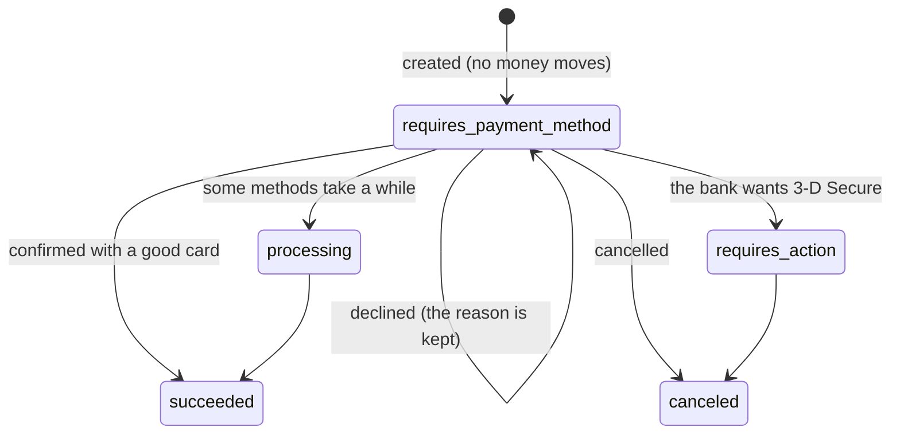
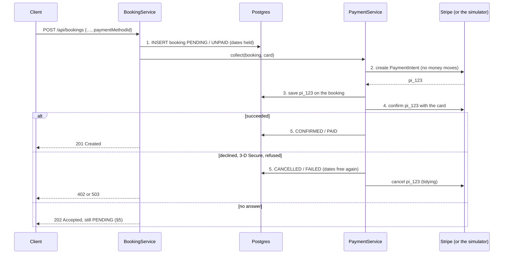
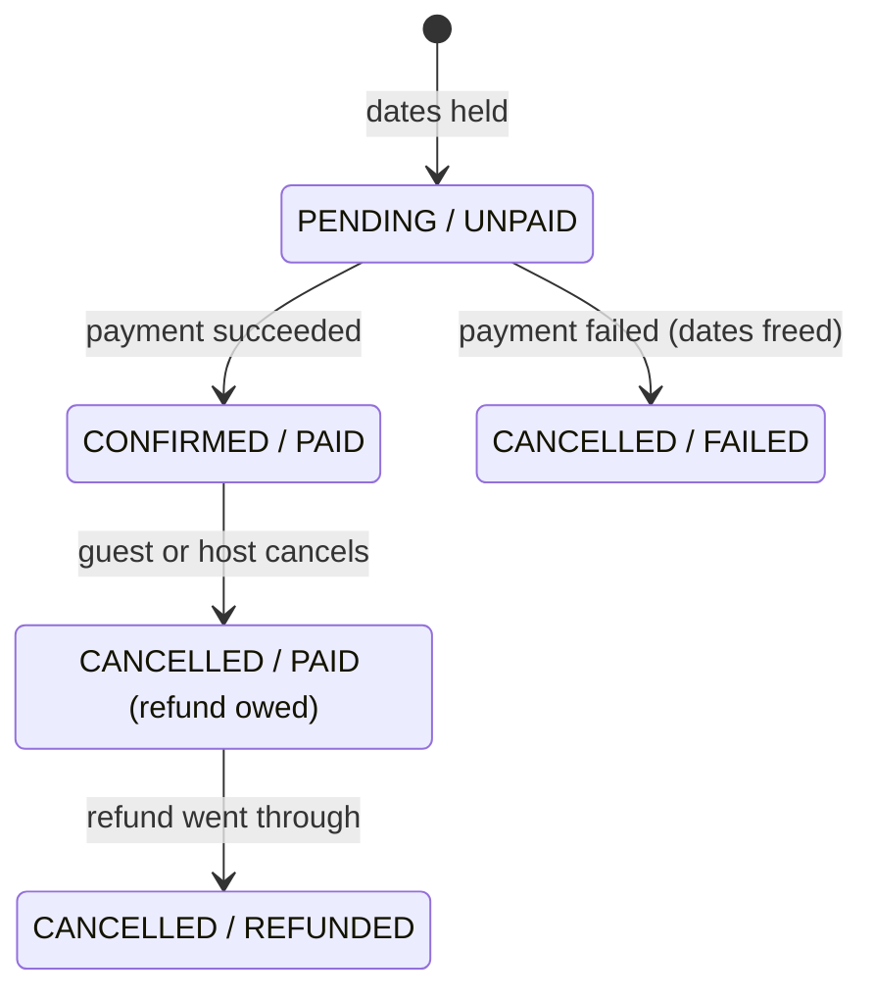

# 05 — Payments, money and currencies

**What Phase 5 built:**
- **Paying for a booking**, through Stripe's PaymentIntents API in test mode, or through a
  built-in simulator when there's no Stripe key.
- **No half-made bookings.** A booking is paid for and confirmed, or released with nothing
  charged. If the payment's outcome is lost, the booking waits briefly while a job finds out
  what happened.
- **Refunds.** Cancelling a paid booking gives the money back in full.
- **Money maths you can trust.** `BigDecimal` everywhere, amounts sent to Stripe in paise
  and cents without a single rounding, and `MoneyMathTest` to show what `double` gets wrong.
- **Prices in other currencies**, shown on request (`?currency=USD`) at a live exchange
  rate, and never stored.
- **A price filter that respects currency.** "Under $100" now compares a rupee listing, a
  dirham listing and a pound listing each in its own currency.

---

## 1. Money: why never `double`

📄 `domain/model/MoneyMathTest.java`, `domain/model/enums/Currency.java`

A `double` stores numbers in base 2. Most decimal fractions (0.1, 0.99) have no exact base-2
form, just as 1/3 has no exact decimal form, so each price is stored very slightly wrong.
You don't see it until prices are added up, multiplied or converted:

| In `double` | Result | Should be |
|---|---|---|
| 2,499.99 + 2,499.99 + 2,499.99 (a 3-night stay) | `7499.969999999999` | 7,499.97 |
| 30 nights at 1,299.90, added night by night | `38997.00000000002` | 38,997.00 |
| `(long) (2499.99 * 100)` (rupees to paise) | `249998` | 249,999 |

The last one is the classic payment bug: the multiplication gives `249998.99999999997`, and
the cast to `long` chops off the fraction. The guest is charged a paisa less than they were
shown. Multiply that by every booking and the books stop balancing.

`BigDecimal` stores an exact decimal: digits plus a *scale* (how many of them are after the
point). The project's rules, all of which `MoneyMathTest` demonstrates:

- **Build money from strings**, never from doubles: `new BigDecimal("0.1")`.
  `new BigDecimal(0.1)` faithfully copies the double's error:
  `0.1000000000000000055511151231257827…`.
- **Compare with `compareTo`, never `equals`.** `equals` also compares the scale, so
  `2500.0000` (from `NUMERIC(19,4)`) is not "equal" to `2500.00` (from a request).
- **Every division names its rounding.** `100.00 ÷ 3` has no exact answer, so BigDecimal
  refuses (`ArithmeticException: Non-terminating decimal expansion`) until you say how many
  decimals and which `RoundingMode`.
- **Half-even rounding** (`HALF_EVEN`, "banker's rounding"): an exact half goes to the even
  neighbour (2.345 → 2.34, 2.355 → 2.36). Over many roundings, half the halves go down and
  half go up, so totals don't creep upwards the way they do with `HALF_UP`.

**Minor units.** Payment providers take amounts as whole numbers of the currency's smallest
unit: ₹7,500.00 is 750000 paise, $139.99 is 13999 cents. `Currency.toMinorUnits` does this
with `movePointRight(fractionDigits()).longValueExact()`:

- `movePointRight(2)` shifts the decimal point exactly, with no multiplication at all;
- `longValueExact()` refuses (throws) if a fraction of a paisa is left, instead of rounding
  it away.

Such an amount can't legally exist here (Phase 1 refuses prices with more decimals than
their currency), so if one ever turns up, failing loudly is right.

---

## 2. Stripe on one page

**Test mode.** Every Stripe account has two sets of keys. *Live* keys move real money; *test*
keys (`sk_test_…`) behave the same way but nothing is real, and Stripe provides fake cards
to try every outcome. This project uses test mode only, and refuses a live key (§8).

**PaymentMethod.** A saved way to pay: a card, turned into an id such as `pm_1Nx…` by
Stripe's own form in the browser, so card numbers never reach our server. In test mode
there are ready-made ones:

| Test payment method | What it does |
|---|---|
| `pm_card_visa` | succeeds |
| `pm_card_visa_chargeDeclined` | declined (`card_declined`, `generic_decline`) |
| `pm_card_visa_chargeDeclinedInsufficientFunds` | declined (`insufficient_funds`) |
| `pm_card_authenticationRequired` | the bank wants the cardholder to approve it (3-D Secure) |

**PaymentIntent.** Stripe's record of *one attempt to collect one amount*. It has a life of
its own:



Why an intent rather than a simple "charge this card" call? Because real payments aren't
instant or certain. The card may need the bank's approval, some methods take days, and the
answer may arrive after your request has timed out. A PaymentIntent has an id from the
moment it's created, so you can always ask Stripe "what happened to pi_123?". That's what
makes safe recovery possible (§5).

**Idempotency key.** A label you attach to a request that changes something. If Stripe
receives the same key twice (the network dropped the first answer, and the client sent the
request again), it replays its first answer instead of acting twice. So a retry can never
charge or refund twice.

---

## 3. Why the payment can't be inside the database transaction

The obvious code is "in one `@Transactional` method: insert the booking, charge the card,
commit". It's wrong both ways round:

- **Charge, then the commit fails** (the constraint refuses the row, the database hiccups):
  the guest has paid for a booking that doesn't exist. Rolling back the database can't roll
  back Stripe.
- **Even when it works**, the transaction holds a database connection, and the row locks
  from the insert and the listing's version bump, for as long as Stripe takes to answer.
  That's often a second, and up to the timeout. Under load, the connection pool empties.

The general answer to "one action across two systems" is a **distributed transaction**
(two-phase commit, 2PC: both systems vote, then both commit). Stripe doesn't take part in
anyone's 2PC, and hardly any web API does. So the project's rule (in CLAUDE.md): **no
external call inside a database transaction.** The payment is taken *between* transactions.

---

## 4. The saga: paying for a booking step by step

📄 `service/BookingService.book`, `service/PaymentService.collect`, `service/BookingUpdates`

A **saga** is a sequence of steps, each committed on its own, where a failure part-way is
repaired by a **compensating action**: a new step that undoes the effect of an earlier one.
For a booking, the compensating action for "hold the dates" is "cancel the booking".



Why each step is where it is:

1. **The dates are held first**, before any card is touched. The booking goes in as
   `PENDING`, and the overlap constraint counts `PENDING` bookings, so nobody else can take
   the dates while the payment happens. Phase 3's retry, version race and constraint all
   still apply, unchanged. A booking that can't happen (dates taken, a rule broken) never
   reaches Stripe.
2. **Create before confirm**, two calls instead of one. Creating a PaymentIntent moves no
   money, and it gives the payment an id.
3. **Record the id before any money can move.** This short transaction is the most
   important step in the saga. From here on, whatever happens (a crash, a lost answer), the
   booking says which payment to ask about.
4. **Confirm**: the card is charged, or not.
5. **Settle.** Paid: `CONFIRMED`. Not paid: the compensating action cancels the booking,
   and its dates are free at once. The PaymentIntent is also cancelled at Stripe, but that's
   tidying, not safety: completing it would need details that never leave our server.

**Two statuses, not one.** A booking now has a `status` (is the stay on?) and a
`paymentStatus` (where is the money?). They move together while the payment happens, then
part: a cancelled booking stays `PAID` until its refund goes through.



Keeping the spec's four booking statuses and adding a separate payment status was a
judgement call. The alternative, a new `PAYMENT_FAILED` booking status, mixes up two
questions. The transitions live on the entity (`Booking.paid()`, `paymentFailed()`,
`cancel()`, `refunded()`), and each refuses a step out of order.

**A failed payment keeps its row.** The booking becomes `CANCELLED`/`FAILED` instead of
being deleted, for two reasons:
- bookings are records (Phase 2 already refuses to delete a listing that has any);
- Stripe's PaymentIntent carries `booking_id` in its metadata, and it must point at
  something.

Every way a booking can end:

| What happened | The booking afterwards | The answer | The dates |
|---|---|---|---|
| paid | `CONFIRMED` / `PAID` | **201** | held |
| card declined | `CANCELLED` / `FAILED` | **402** `payment.declined` | free |
| bank wants 3-D Secure | `CANCELLED` / `FAILED` | **402** `payment.authenticationRequired` | free |
| Stripe refused the request (bad key, rate limit) | `CANCELLED` / `FAILED` | **503** `payment.unavailable`, `Retry-After: 60` | free |
| the payment couldn't even be created | `CANCELLED` / `FAILED` | **503** | free |
| no answer (timeout, an error inside Stripe) | `PENDING` / `UNPAID` | **202** | held, until the job settles it |
| the app stopped part-way | `PENDING` | (the request failed) | held, until the job settles it |

The status codes:
- **402 Payment Required** is the code Stripe itself uses for card errors.
- **503** with `Retry-After` says "not your fault, try again in a minute".
- **202 Accepted** means "your request was accepted but isn't finished". The `Location`
  header says where to look.

---

## 5. When the answer is lost: the reconciliation job

📄 `scheduling/PaymentReconciliationJob.java`, `PaymentService.settle`

**Why "no answer" isn't "failed".** If the confirm request times out, the charge may or may
not have happened: perhaps Stripe charged the card and the reply was lost on the way back.
Releasing the dates would then let someone else book them while the first guest has paid.
Calling it a success would confirm a stay nobody paid for. The only honest answer is "not
known yet", so the booking stays `PENDING`, with its dates held.

**Reconciliation** means checking your records against someone else's and fixing the
differences. Every 5 minutes (`PAYMENT_RECONCILIATION_CRON`), the job:

1. finds bookings still `PENDING` after 10 minutes (`PAYMENT_STALE_AFTER`). That's far longer
   than a live payment can take, so it never races one. (A payment makes two calls, each
   allowed a 20-second read timeout and 2 retries: about 2 minutes at the very worst.);
2. for each: no payment id recorded → the app stopped before step 3, so no money can have
   moved → release it. Otherwise it asks the provider (`lookUp`): succeeded → confirm; any
   kind of failure → release it and cancel the payment; still unknown → ask again next run;
3. finds cancelled bookings still `PAID` (refunds owed, §6) and tries the refund again.

Like StaleListingJob, it handles each booking in its own transactions, records its changes
as `system:payment-reconciliation-job`, and logs a summary. It runs quietly (debug level)
when it found nothing to do, since it runs every few minutes.

**Idempotency keys make every retry safe.** Each Stripe call carries a key built from the
booking and the step: `rentalhub-booking-42-1789430551123-refund`.
- **The same key for the same step**, so a network retry, or the job trying a refund
  again, gets the first answer back instead of a second refund.
- **The creation time is in the key** because booking ids alone can repeat. Wipe a
  development database and booking 1 exists again. Stripe keeps keys for 24 hours, and it
  would answer the new booking 1's request with the old booking 1's payment.
- **The creation time is cut to microseconds** when the booking is saved (Postgres keeps
  no more). So the value in memory equals the value stored, and a key built before a
  reload matches one built after it.

---

## 6. Refunds

📄 `BookingService.cancel`, `PaymentService.refundIfOwed`

Cancelling works as in Phase 3 (guest or host, until check-in day, idempotent), and a paid
booking is now refunded in full. Full, because Phase 3's rule is "free cancellation until
check-in"; real cancellation policies (partial refunds, fees) are listed in the
limitations.

It's two steps, for the same reason as paying:

1. **Cancel**, in its own transaction: the dates are free at once. The booking is now
   `CANCELLED` and still `PAID`, which reads as "refund owed".
2. **Refund**, outside any transaction, with its own idempotency key. Success:
   `REFUNDED`, with the refund's id.

If the refund fails, the cancellation stands (the guest asked for it, and the dates are
already free), and the refund stays owed:
- the reconciliation job retries it;
- cancelling again also retries it, since a repeated cancel is harmless.

A booking whose payment is still `PENDING` can't be cancelled (409
`booking.cancel.paymentPending`), because a cancel would race the payment's own outcome. The
job settles it within minutes, and then it can be cancelled like any other.

---

## 7. The simulator, and why it exists

📄 `payment/SimulatedPaymentGateway.java`, `config/StripeConfig.java`

The project must work end to end with no Stripe account (a hard constraint), and there's a
practical reason too: [Stripe accounts in India are invite-only](https://support.stripe.com/questions/stripe-accounts-are-invite-only-in-india),
so you may not be able to get keys at all.

**Why not skip payment without a key?** That was the original plan (decision D31): confirm
the booking and take no payment. But then the most interesting part of this phase (declines,
lost answers, refunds, the job) could never be seen outside the tests, and a deployed demo
would have no payment step. So, without a key, payments go to a simulator that:
- **answers to Stripe's own test ids** (`pm_card_visa` succeeds, anything with "Declined"
  is declined, `pm_card_authenticationRequired` wants 3-D Secure), so the same requests
  work unchanged once a real key is added;
- **adds two ids of its own**, for what test cards can't show:
  - `pm_sim_noAnswer`: the payment goes through, but the answer is "lost";
  - `pm_sim_providerDown`: the provider refuses the request;
- **is honest about itself.** Every payment it takes says `"provider":"SIMULATED"`, and the
  app logs `payments.mode provider=SIMULATED` at startup. Its references start `sim_pi_`.

Both gateways implement one interface, `PaymentGateway`, with five operations: create,
confirm, look up, cancel, refund. `PaymentService` doesn't know which one it's talking to.
The booking stores which provider took its money (`payment_provider`). So a booking the
simulator took is still looked up and refunded by the simulator, even after a Stripe key is
added.

---

## 8. Stripe in the code

📄 `payment/StripePaymentGateway.java`

- **The client:** `StripeClient` from the official `stripe-java` library (33.4.2), with a
  5-second connect timeout, a 20-second read timeout, and 2 automatic retries of requests
  whose answer was lost. Those retries are safe because of the idempotency keys.
- **Creating** a PaymentIntent sends:
  - `amount` in minor units;
  - `currency` in lower case (`inr`);
  - `metadata[booking_id]`, so the Stripe dashboard links back to the booking;
  - `automatic_payment_methods[allow_redirects]=never`. Methods that send the payer to their
    bank's website need a browser to come back to, and this API has none.
- **Confirming** happens on the server with the `paymentMethodId` the client sent. A real
  web page would collect the card with Stripe's own form (Stripe.js) and confirm in the
  browser.
- **Reading the answer.** Stripe's errors arrive as exceptions, and each maps to one outcome:

  | Stripe says | Outcome | Why |
  |---|---|---|
  | `CardException` (HTTP 402) | declined | the card said no |
  | `InvalidRequestException` about `payment_method` | declined | an unusable payment method is the guest's to change |
  | `ApiConnectionException`, `ApiException` (500) | **undecided** | the charge may or may not have happened |
  | any other error (bad key, permissions, rate limit) | not charged | refused before anything happened |
  | status `requires_action` | 3-D Secure needed | |
  | status `processing` | undecided | |

- **Keys.** `STRIPE_SECRET_KEY` comes from the environment, never from the repo:
  - an empty key means the simulator;
  - `sk_test_…` or `rk_test_…` (a restricted test key) means Stripe;
  - anything else, such as a live `sk_live_…`, is refused with an error in the log, and
    payments are simulated. A key pasted into the wrong place must never charge a real card.

  The key itself is never logged (`StripeConfigTest` checks).
- **Tested against a fake Stripe.** `StripePaymentGatewayTest` starts a tiny HTTP server
  that answers like Stripe's API, and points the real library at it (`setApiBase`). That
  proves what is actually sent (amounts, the key, the idempotency key) and how every answer
  is read, with no account and no network.

---

## 9. Prices in other currencies

📄 `service/CurrencyService.java`, `fx/ExchangeRateApiSource.java`, `fx/ExchangeRates.java`

**The rule:** what a guest is charged, and what is stored, is always the listing's own price
in the listing's own currency. A converted figure is worked out per request, shown beside
the real one, and never saved. Rates move every day, so a stored conversion would be wrong
tomorrow, and the books would stop matching what was charged.

**Showing it.** Any read takes `?currency=INR|USD|EUR|GBP|AED`:

```json
"pricePerNight": 2500.0000, "currency": "INR",
"displayPrice": {"amount": 26.13, "currency": "USD", "rate": 0.010452, "ratesAsOf": "2026-09-15T00:02:31Z"}
```

Bookings get a `displayTotal` the same way. A booking made with `?currency=USD` still
stores, audits and charges rupees; `CurrencyApiTest` checks all four places.

**Where the rates come from.** [ExchangeRate-API's free "open access"
endpoint](https://www.exchangerate-api.com/docs/free) (`open.er-api.com/v6/latest/USD`):
- no key, no sign-up;
- about 160 currencies, updated once a day. Frankfurter, the other well-known free API,
  publishes the European Central Bank's rates, which have no AED.
- its terms: fetch at most about once an hour, and credit "Rates By Exchange Rate API" on
  pages that show the rates (the Phase 8 pages will).

The rates arrive as JSON numbers and are read straight into `BigDecimal` from their digits.
Reading them into a `double` first would already have rounded them
(`ExchangeRateApiSourceTest` checks `95.674534` survives exactly).

**Converting through the base.** The provider gives "units per US dollar" for each
currency. Rupees to euros is `amount × rate(EUR) ÷ rate(INR)`: one multiplication (exact)
and one division, so the result is rounded **once**, to the target currency's decimals,
half-even. Converting to dollars first and then onwards would round twice.

**Caching the rates, and surviving the provider being down.** `CurrencyService` keeps the
last set in memory:

| Situation | What happens |
|---|---|
| Rates less than an hour old | used as they are; no network call |
| Older than an hour | the next request fetches a new set (the others carry on with the old one meanwhile) |
| The fetch fails | the old set stays in use, and no one tries again for a minute |
| Last updated more than 48 hours ago | not shown at all: `displayPrice` is missing, and the page says so |
| Never fetched, provider down | only same-currency prices can be shown |

Three details make this robust:
- **Stale-if-error:** a slightly old rate is far more useful than none.
- **A retry delay after a failure:** without it, a provider outage would add a timeout to
  *every* request.
- **One fetch at a time:** `tryLock` means that while one request fetches, the others don't
  queue behind it, and they don't all fetch at once either (a *stampede*, as in Phase 2).

The HTTP client has its own short timeouts (2-second connect, 3-second read), so a slow
provider costs one request a few seconds, never a hang.

Why not Redis? One instance; each would fetch once an hour, which is nothing. With many
instances, sharing the rates through Redis would save calls.

---

## 10. `maxPrice` across currencies

📄 `CurrencyService.ceilings`, `PriceCeilings`, `PropertySpecifications.search`

Before, `maxPrice=5000` compared raw numbers, so ₹4,999 and $4,999 both "matched". Now the
limit has a currency (`?maxPrice=100&currency=USD`), and the **limit** is converted into
every listing currency, rather than every listing's price:

```sql
WHERE active
  AND (  (currency = 'INR' AND price_per_night <= 9567.4534)
      OR (currency = 'USD' AND price_per_night <= 100.0000)
      OR (currency = 'EUR' AND price_per_night <= 86.5688)
      OR (currency = 'GBP' AND price_per_night <= 74.0963)
      OR (currency = 'AED' AND price_per_night <= 367.2500))
```

- **Five comparisons, whatever the number of listings**, each able to use the price index.
  Converting every listing's price would mean either computing inside the query or storing
  converted prices, and stored conversions are exactly what we never want.
- **Ceilings are rounded down**, never up, so rounding can't let in a listing that costs
  more than the limit.
- **Without a `currency`, `maxPrice` means rupees** (`rentalhub.fx.default-currency`), so
  searches written before Phase 5 mean exactly what they meant before.
- **Without rates**, only listings in the limit's own currency can be compared. The others
  are left out (never let in unfiltered), the page says `"exchangeRatesUnavailable":true`,
  and that page isn't cached. An incomplete answer must not outlive the outage.
- **The currency is part of the search cache key** (`…|maxPrice:100|currency:USD|…`):
  "100 dollars" and "100 rupees" are different searches. Without a limit the currency changes
  nothing, so it's dropped from the key, and those searches still share one entry.
- **The cached records gained a field** (`displayPrice`, always empty in the cache), so the
  key prefix went from `rentalhub:v1:` to `rentalhub:v2:`. New code never reads old-shaped
  JSON; the old keys simply expire (Phase 2, §4).

---

## 11. How it's tested

| Test class | Kind | Proves |
|---|---|---|
| `MoneyMathTest` | unit | double drifts (3 × 2,499.99 = 7499.969999999999), loses a paisa converting to minor units; BigDecimal from strings, `compareTo`, rounding modes, half-even |
| `BookingTest` (4 new tests) | unit | the payment steps in order; a failed payment cancels and frees the dates; a refund is owed after cancelling a paid stay; steps out of order are refused |
| `ExchangeRatesTest` | unit | conversion through the base, rounded once as asked; missing rates |
| `ExchangeRateApiSourceTest` | unit | the provider's JSON read digit for digit; error answers, HTTP 429 and useless answers refused |
| `CurrencyServiceTest` | unit | one fetch an hour; the last good rates kept through an outage; a minute between retries; stale rates hidden; no stampede; display rounding; ceilings rounded down |
| `StripePaymentGatewayTest` | unit, fake Stripe | what is sent (paise, currency, booking id, no redirects, idempotency keys); every kind of answer understood |
| `SimulatedPaymentGatewayTest` | unit | the test ids, idempotency, refunds only after a success |
| `StripeConfigTest` | unit | no key: simulated; test key: Stripe; live key refused, and never logged |
| `PaymentServiceTest` | unit | the saga's order; every failure releases the dates and cancels the payment; a lost answer releases nothing; refunds; settling |
| `BookingServiceRetryTest` (updated) | unit | the payment is taken once the dates are held, and never for a refused booking |
| `PaymentReconciliationJobScheduleTest` | unit | every 5 minutes; it waits longer than a live payment can take |
| `BookingPaymentApiTest` | integration | every ending through the API; dates released at once; 202, then settled by the job; refunds; the audit history of a payment |
| `CurrencyApiTest` | integration | `displayPrice`; neither cache tier holds one; `maxPrice` across currencies; a converted total is never persisted (row, history, schema, charge) |
| `PaymentReconciliationJobTest` | integration | a lost answer confirmed, recorded as the job's; never-confirmed and never-recorded payments released; young ones left alone; refunds retried |

Updated too: `SearchCacheKeysTest`, `BookingRulesTest`, `GlobalExceptionHandlerTest`,
`PersistenceMappingTest`, `BookingApiTest`.

**Total after Phase 5: 269 tests (183 unit, 86 integration), all passing.**

---

## Interview questions — practise answering these aloud

**Q: Why BigDecimal for money?**
A double is binary, and most decimal fractions can't be stored exactly, so totals drift:
three nights at 2,499.99 comes to 7499.969999999999. Worse, converting rupees to paise with
`(long)(price * 100)` truncates, and loses a paisa. BigDecimal is exact decimal arithmetic.
I build it from strings, compare with `compareTo`, and give every division a scale and
rounding mode.

**Q: Why not charge the card inside the booking's transaction?**
A database rollback can't undo a charge, so if the commit failed after charging, the guest
would have paid for nothing. And a transaction held open during a network call ties up a
connection and its locks for as long as the provider takes. So I never call an external
system inside a transaction. The booking is paid for in steps, each committed on its own.

**Q: What's a saga?**
A sequence of local transactions where a failure part-way is repaired by compensating
actions instead of a rollback. Mine holds the dates (a PENDING booking), creates the payment,
records its id, confirms it, then either confirms the booking or cancels it, which frees the
dates. It's the standard pattern when one business action spans systems that can't share a
transaction.

**Q: What if the server crashes after charging but before confirming the booking?**
The payment's id was saved before the charge, so the booking is PENDING with a known
payment. The reconciliation job finds PENDING bookings older than ten minutes, asks the
provider what happened to that payment, and confirms or releases the booking. If it crashed
before the id was saved, no charge can have happened, so the job just releases the dates.

**Q: What is an idempotency key, and how do you build yours?**
A label on a request that makes a repeat of it return the first answer instead of acting
again. Mine is the booking id, the booking's creation time, and the step. The time is there
because ids repeat when a development database is wiped, and the provider remembers keys
for a day.

**Q: Why hold the dates before charging, instead of charging first?**
Nobody should pay for dates that turn out to be taken, and a booking that can't happen never
reaches the payment provider. The alternative is authorise-then-capture: reserve the money on
the card, book, then capture it, or release it if the booking fails. That works too, but it
touches the card for bookings that fail, and authorisations expire after about a week.

**Q: Why 402, 503 and 202?**
402 Payment Required for a declined card; it's what Stripe uses. 503 with Retry-After when
the provider refused or couldn't be reached before anything happened: not the guest's
fault, try again later. 202 Accepted when the outcome isn't known yet: the booking exists,
its dates are held, and the Location header says where to check.

**Q: Why keep a booking whose payment failed?**
It's a record. The provider's payment carries its booking id in the metadata, the audit
history shows the attempt, and support can answer "why was I not charged?". It's cancelled,
so its dates are free, and a separate payment status says FAILED.

**Q: How do refunds work, and what if the refund fails?**
Cancelling commits first, which frees the dates, then the refund is requested with its own
idempotency key. If that fails, the booking stays cancelled but PAID, which is a queryable
"refund owed" state. The reconciliation job retries it, and the same key means it can never
refund twice.

**Q: Isn't a payment simulator just faking it?**
It's graceful degradation. The app must work without credentials, and Stripe accounts in
India are invite-only. The simulator answers to Stripe's own test ids, and every payment it
takes is labelled SIMULATED. Both it and the Stripe gateway implement one interface, so the
business logic is identical. The Stripe gateway itself is tested against a fake Stripe HTTP
server.

**Q: How would you support 3-D Secure?**
Create the PaymentIntent on the server, confirm it in the browser with Stripe.js, which shows
the bank's challenge, then confirm the booking from a webhook (`payment_intent.succeeded`) or
by looking the payment up when the browser returns. The saga and the reconciliation job stay
the same.

**Q: Why no webhooks?**
The server confirms payments itself, so it gets the answer directly, and the job covers lost
answers by looking payments up. Webhooks become necessary with browser-side confirmation or
slow payment methods. They'd need signature verification and idempotent handling, because
Stripe delivers each at least once.

**Q: How do you show prices in other currencies without storing them?**
Rates are fetched from a free API, at most once an hour, and kept in memory. Conversions are
computed per request, rounded once, and added to a copy of the cached record. The stored
booking total is always in the listing's currency, and a test checks the row, the audit
history, the schema and the charge.

**Q: What happens when the exchange-rate provider is down?**
The last good rates stay in use for up to 48 hours, and a failed fetch isn't retried for a
minute, so an outage never adds a timeout to every request. With no usable rates,
conversions are left out, and the price filter compares only listings in the filter's own
currency. The response says so, and those pages aren't cached.

**Q: How does maxPrice work across currencies?**
I convert the one limit into every listing currency and query
`(currency = 'INR' AND price <= x) OR (currency = 'USD' AND price <= y) …`. The ceilings are
rounded down, so no listing over the limit slips in, and the query stays index-friendly
without storing converted prices.

**Q: Why charge in the listing's currency, not the guest's?**
The host priced it, and that's the amount the host should receive. Charging in the guest's
currency would mean choosing a rate, taking the currency risk, and storing a converted
amount. The guest's card issuer converts, as it does abroad.

---

## Honest limitations

- **Cards that need 3-D Secure can't pay** (402). That needs the browser flow above.
- **No webhooks.** A payment changed outside RentalHub (a refund from the Stripe dashboard)
  is only noticed when RentalHub next asks.
- **Full refunds only.** No cancellation policies, partial refunds or fees.
- **No `Idempotency-Key` on `POST /api/bookings` itself.** A client that retries after a
  timeout sends a second booking. The overlap rule stops it double-booking the same dates
  (the first booking holds them), but a proper API would accept the client's own key.
- **Stripe's minimum amounts** (about 50 US cents in each currency) would turn a
  ridiculously cheap booking into a 503.
- **The simulator forgets on restart.** Pending simulated payments are then released by the
  job. It's a stand-in, not a bank.
- **Rates are indicative.** They come from a free, daily source, have no history, and give
  no rate for a past booking. Fine for "about how much", not for accounting.
- **The default currency (INR) is global.** A per-person currency choice arrives with the
  Phase 8 pages.
- **The reconciliation job assumes one instance** (no distributed lock), like StaleListingJob.
- **Not tried against real Stripe.** The Stripe gateway is tested against a fake Stripe
  server, not a real account (see the last section).

---

## Try it yourself

1. **See the drift.** In `MoneyMathTest.multiNightTotalDriftsWithDouble`, change 3 nights to
   300, and print `total`. How far off is it?
2. **Skip the crucial step.** In `PaymentService.collect`, comment out
   `updates.recordPaymentStarted(...)` and run `PaymentServiceTest` and
   `BookingPaymentApiTest`. Which tests notice, and why is this the step that makes recovery
   possible? Put it back.
3. **Watch a lost answer being settled.** Hands-on guide Part 40: `pm_sim_noAnswer`, with
   the job running every 20 seconds.
4. **Take the rates away.** Start the app with
   `$env:FX_RATES_URL = "https://open.er-api.com/v6/latest/XYZ"` (an unknown currency code,
   so the provider answers with an error). Search with `?maxPrice=100&currency=USD`: only
   dollar listings, and `"exchangeRatesUnavailable":true`. A listing read with
   `?currency=INR` still shows a `displayPrice` for a rupee listing (no conversion needed).
5. **Break the ceiling rounding.** In `CurrencyService.ceilings`, change `RoundingMode.DOWN`
   to `UP` and run `CurrencyServiceTest`. What could a guest now see in their results?

---

## If you get a Stripe test key

*Not verified by me: I have no Stripe account. Everything here follows Stripe's
documentation, and the gateway is covered by `StripePaymentGatewayTest`.*

1. Sign in to the Stripe dashboard in test mode, and copy the secret key from
   **Developers → API keys** (`sk_test_…`). Never commit it or paste it into a file in the
   repo.
2. In Window 1, before starting the app:
   ```powershell
   $env:STRIPE_SECRET_KEY = "sk_test_your_key"
   ```
   The startup log says `payments.mode provider=STRIPE apiBase=stripe`.
3. Book with `samples/api/booking.json` (`pm_card_visa`). The payment's `provider` is
   `STRIPE` and its `reference` starts with `pi_`. In the dashboard under **Payments**,
   the payment shows the booking id in its metadata.
4. `pm_card_visa_chargeDeclined` gives a 402, as with the simulator. The `pm_sim_…` ids
   don't exist at Stripe: Stripe calls them unknown payment methods, so they're declined.
5. To go back to the simulator: `Remove-Item Env:STRIPE_SECRET_KEY` and restart.

---

## YouTube for this phase (in order)

1. `floating point precision explained` and `bigdecimal vs double java money`
2. `stripe payment intents tutorial`
3. `stripe test mode test cards`
4. `saga pattern compensating transaction` and `distributed transactions two phase commit`
5. `idempotency key payments`
6. `3d secure strong customer authentication`
7. `webhooks explained`
8. `currency conversion api` and `stale while revalidate caching`

Clickable versions are in the [project log](project-log.md#6-youtube-study-plan--every-phase).
